# Web Notes

前端学习笔记

**Begin on 17 Feb 2022**

**Presented By R.G.**


## CSS

Cascading Style Sheets，层叠样式表

[w3school CSS 教程](https://www.w3school.com.cn/css/index.asp)

### 基础认知

+ css 基本构成：css 规则集由选择器和声明块组成，分号分隔多个属性

    ```css
  选择器{ 
  	属性名1: 属性值;
  	属性名2: 属性词;
  	/* 这是注释，注意区别html的注释 */
      /* 
      	选择器作用：查找需要设置样式的标签
      */
  }
  ```

+ css 的引入方式：

  + **内嵌式：** css写在style标签内，通常放置在 head 标签内部，通常位于 title 标签下（实际上style可以放在页面任意位置，但是通常约定前述写法）

  + **外联式：** css 写在一个单独的 `.css` 文件中，通过 link 标签进行引入

    + `.css`文件中不需要写 style 标签，直接写 css 代码即可
    + 注意在引入时，link 标签 不需要放在 style 标签中【只要记住，style标签一开启，内部就不再是html语法了，内部是 css 语法】

    `<link rel="stylesheet" href="xxx.css">`

  + **<a name="s">行内式</a>：** css 直接写着需要控制的某个标签中，使用标签的 style 属性进行控制，空格分隔多个css属性，通常配合 js 使用

    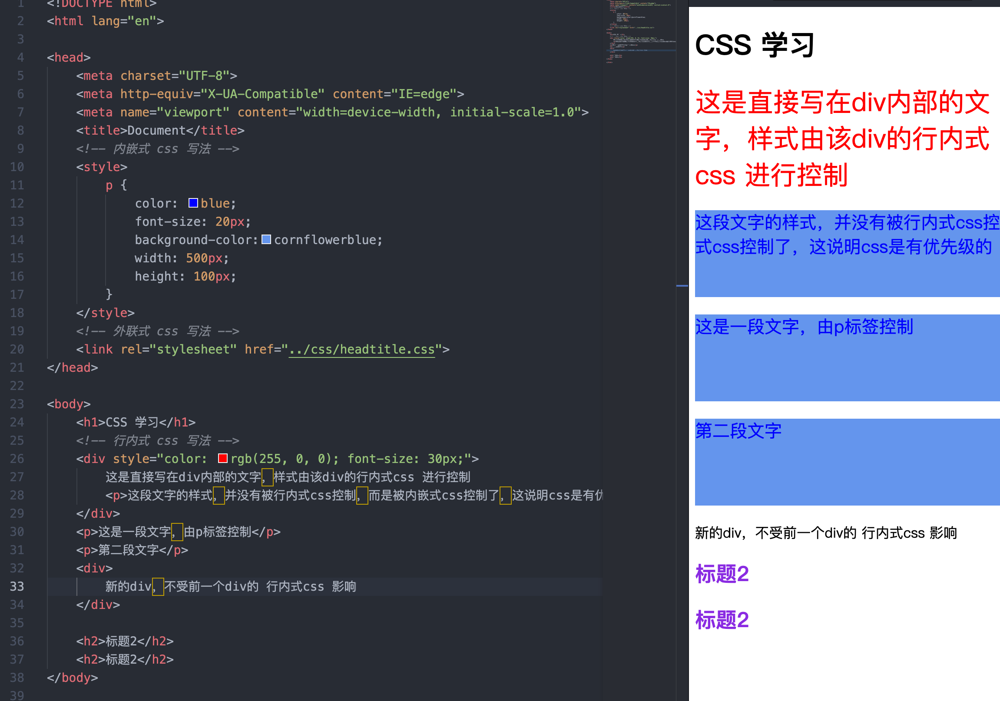

  | css 引入方式 | 书写位置                             | 作用域                         | 通常使用场景 |
  | ------------ | ------------------------------------ | ------------------------------ | ------------ |
  | 内嵌式       | style标签内部                        | 当前html文件（当前页面）       | 一些小案例   |
  | 外联式       | `.css`文件中，由 link 标签进行引入   | 可作用到多个页面，只要进行引入 | 大部分项目   |
  | 行内式       | 直接写着某个具体标签 的 style 属性内 | 仅仅作用于该具体标签           | 配合 js 使用 |

### 基础选择器

+ **标签选择器**：` 标签名 { 属性名1: 属性值1; 属性名2: 属性值2; }`

  + 会将样式生效到所有 同名标签，无论嵌套多深

+ **类选择器**：` .类名 { 属性名1: 属性值1; 属性名2: 属性值2;}`

  + 样式生效到所有 含有该类名的 标签

  + 类名即 标签中的 class 属性，类名可以由数字、字母、下划线、中划线组成，但不能以数字或中划线开头【但是我试了一下，中划线开头是可以的，macOS+vscode+chrome v98，不用管那么细了，正常应该不会取这种怪异的名字的】

    + `001、-001` 是非法类名，但是 `_001` 是合法类名

  + 一个 标签 可以有多个类名，类名之间以空格分隔 `<input type="text" class="class1 class-2 class_3">`

    + 这里有个小细节，若样式类型相同，生效的是第一个，见下<a name="t1">例子</a>：

      ```html
      /* css code */
      .red-1 { /* 类名可以使用 - 符号 */
      	color: red;
      }
      .red_2 { /* 类名可以使用 _ 符号 */
      	color: darkred;
      }
      ....................
      <!-- html code -->
      <!-- red-1 生效 -->
      <div class="red-1 red_2"> 
      	...
      </div>
      
      但不得不说，这种写法大概率是喝醉了写错导致的
      ```

    + 注意区别 <a href="#t2">样式层叠性</a>

+ **id 选择器**：` #id属性值 { 属性名1: 属性值1; 属性名2: 属性值2; } ` 

  + 所有标签都可以有 id 属性
  + **id 具有唯一性**，区别于 class 属性，一个标签只能有一个 id 属性值，同时 一个id 只能属于一个 标签（测试发现可以多个标签同一个id，但是不规范，不要这样做）
  + 因此，id 选择器只能 选中一个标签（对上id的标签）
  + 注意，id 值是个字符串，不是个数值，所以 id值可以由数字、字母、下划线、中划线组成，但不能以数字或中划线开头【我试了一下，id中划线开头不可以的，和class不同，macOS+vscode+chrome v98，不用管那么细了，正常应该不会取这种怪异的名字的】
    + `001` 是非法 id，但是 `_001` 是合法 id

+ **通配符选择器**：` * { 属性名1: 属性值1; 属性名2: 属性值2; }`

  + 样式作用于所有标签

  + 一般用于去除某种所有标签自带的默认特性，例如 去除标签默认的 margin、padding

    ```css
    * {
    	margin: 0;
        padding: 0;
    }
    ```

+ **属性选择器：** `element[attr1][attr2] {属性1: 值1; 属性2: 值2;}`
  
  + 将对有 attr1和attr2属性的标签 element 设置样式。
  + https://www.w3school.com.cn/css/css_attribute_selectors.asp
  + https://www.w3school.com.cn/css/css_selector_attribute.asp

### 字体样式

+ 字体样式属性：

  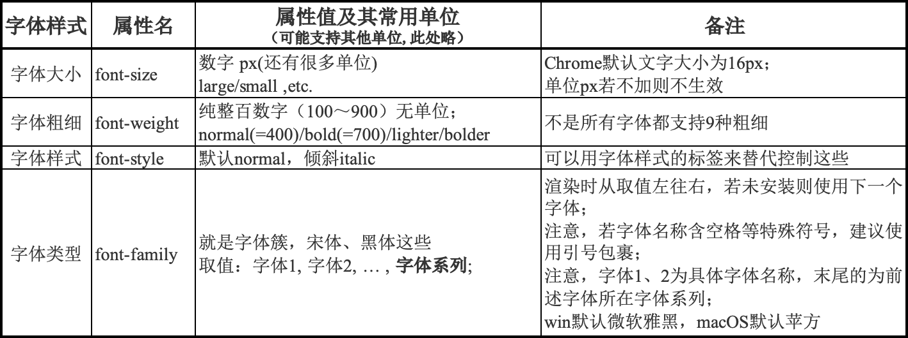

  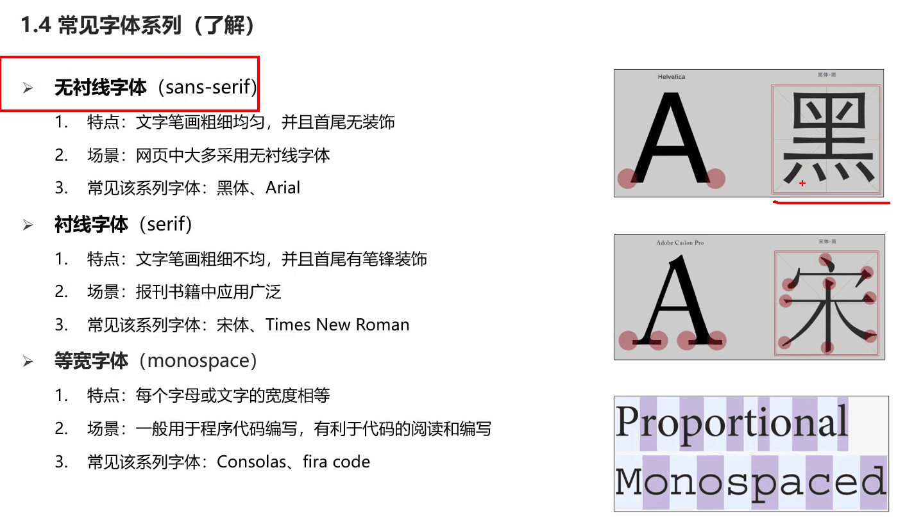

+ font相关属性的连写法（复合属性）：

  ```css
  .font-family {
      font-size: 30px;
      font-weight: 100;
      font-style: italic;
      font-family: 'Segoe UI', Tahoma, Geneva, Verdana, sans-serif;
  }
  /* 连写/简写法，使用 复合属性 */
   .font-family-simple {
       font: italic 100 30px 'Segoe UI', Tahoma, Geneva, Verdana, sans-serif;
       /* 注意顺序必须按照：style weight size famliy，并且不可以有缺失 */
  }
  /* 以上两种写法等效 */
  
  /* 下述写法对font不会生效 */
  .font-family-wrong-order { /* 顺序不对 */
      font: 30px italic 100 Tahoma;
  }
  .font-family-wrong-lack { /* 缺少不可省略属性 */
      font: italic 100 30px;
  }
  
  /* 可以省略缺失前两个属性 */
  .font-family-right-lack-1 {
      font: 30px Tahoma;
  }
  .font-family-right-lack-2 {
      font: italic 30px Tahoma;
  }
  .font-family-right-lack-3 {
      font: 777 30px Tahoma;
  }
  ```
  
  + 复合属性必须按照规则顺序书写，此处font的规则就是
    + **顺序必须按照：style weight size famliy，*可以省略缺失前两个属性值*，省略即使用默认值，但是不能出现不恰当顺序和错误省略**
  
+ 样式层叠性：

  + 若给同一个标签设置了同种类型的样式，则后写的样式会覆盖先写的

    + <a name="t2">例子</a>：

      ```html
      /* css code */
      div { 
      	color: red; /* 不生效，被覆盖掉 */
      	color: gray; /* 生效 */
      }
      ....................................
      <!-- html code -->
      <!--  gray 生效 -->
      <div> 
      	...
      </div>
      ```
      
    + 注意区别 class 那里的<a href="#t1">样式问题</a>
    
  + CSS=Cascading Style Sheet 层叠样式表

### 文本样式

+ 缩进属性 text-indent

  + 常用属性值：
    + 数字 px
    + 数字 em（1em=当前标签的font-size大小，即一个字大小，推荐用这个单位）

+ 水平对齐属性 text-align

  + 属性值：

    + left：左对齐
    + center：居中对齐
    + right：右对齐

  + text-align 也可以控制除了文本以外的其他元素，但是不是直接作用于该标签上的，而是作用在其父标签上

    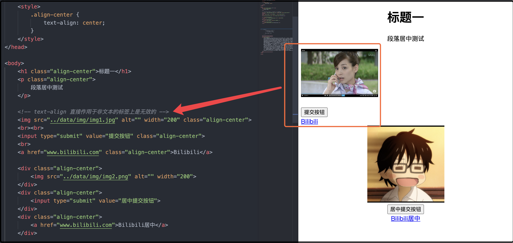

+ 文本修饰属性 text-decoration
  + 常见属性值：
    + underline：下划线
    + line-through：删除线
    + overline：上划线
    + ==none：无修饰，通常用于去掉 a标签 默认的下划线==
  
+ 行高（行间距）属性 line-height：

  + 控制一行文本的上下行间距

    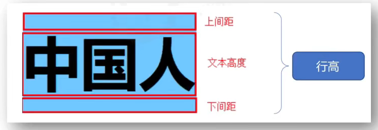

  + 属性值：

    + 数字 px
    + 倍数（即当前标签 font-size 的倍数）

  + ==**特别应用效果:**==

    + ==让 **单行文本 垂直居中**：`line-height: 文字父元素的高度`==
    + ==取消文本上下间距：`line-height: 1`==

  + line-height 属性可以作为复合属性连写到 font属性中，注意规则：

    + `font: style weight size/line-height family;`
    + 若连写line-height，则需要用 `/`紧跟在size后面，注意不是空格分隔

+ 颜色取值：

  | 颜色表示法 | 取值方式                                                     | 例子                                                       |
  | ---------- | ------------------------------------------------------------ | ---------------------------------------------------------- |
  | 关键词     | 颜色单词                                                     | red、gray                                                  |
  | rgb法      | rgb(x,y,z) ，$x,y,z \in [0,255]$                             | black=rgb(0,0,0)、white=rgb(255,255,255)、red=rgb(255,0,0) |
  | rgba法     | rgb(x,y,z,t)，$x,y,z \in [0,255] \subset Z, t \in [0,1] \subset R$ | rgba(255,255,255, 0.5)，最后一项表示透明度，0纯透明        |
  | 十六进制法 | #开头加16进制数(全写6位，可缩写取前三位)                     | black=#000000=#000, white=#ffffff=#fff                     |

  记法：取值0-255，三个颜色通道，某个通道值越大，则该通道的原色越浓，255则拉满，即 rgb(255,0,0)红色拉满，其余原色0，则显示为纯红色，三原色拉满为白，全0为黑（什么都没有就是黑色）; 至于16进制么，255=0xff，所以知道为啥6位了吧

### 标签的居中方法

+ 给标签添加css样式，属性及其值为：`maring: 0 auto`，上下边界为0，左右自适应相同值

+ 一般用于盒子上，类似div
+ 更方便的方法，是使用flex布局


### 选择器进阶知识

+ 复合选择器

  + 后代选择器：`选择器1 选择器2 { css属性 }`

    + 根据标签嵌套关系，选择父元素 **后代** 中所有满足条件的元素

    + 在选择器1所找的标签的后代（所有内嵌标签，子标签、孙标签、重孙标签…）中，找到满足选择器2条件的所有标签，设置样式

    + 可以一直叠的，而且选择器可以用基础选择器的所有类型

      `.class1 .class2 #id1 { attr:value}`

  + 子代选择器：`选择器1 > 选择器2 { css属性 }`

    + 根据标签嵌套关系，选择父元素 **子代** 中所有满足条件的元素
    + 子代选择器也可以叠加，但是注意 至找关系的 子代

    `.class1 > .class2 > #id1 { attr:value}`

  + 并集选择器：`选择器1 , 选择器2 { csss属性 }`

    + 集合关系的 并关系

    + 可以多个选择器叠加，通常换行书写，如下：

      ```css
      .class1,
      .class2,
      #id1,
      #id2 {
      	attr1: value1;
      	attr2: value2;
      ```

  + 交集选择器：`选择器1选择器2 { css属性 }`

    + 选择器之间紧挨，不存在任何空格或者其他符号

    + 如果交集选择器中 有标签选择器（即标签名），则标签选择器必须写在最前面

      + 测试发现，如果有多个标签选择器连在一起是无法区分开的（即无法解析 多个标签的交集）

        `divp { css attrs}` 无法解析成 div 和 p 标签的交集

        `div.classp {css attrs}` 也无法解析成 div标签、含class类的标签、p标签的交集

        其实很好理解么，没有空格，单词连在一起没办法区分出来了

      + 可以是多个类的交集：`.class1.class2.class3 { css attrs}`

  + hover 伪类选择器：`选择器:hover { css 属性}`

    + 伪类选择器的作用是，显示鼠标悬停时的css属性

    + 注意此处的选择器，可以是任何选择器组合，例如下面是一个交集选择器的伪类操作

      `div.class1:hover { css attrs}`

    + 注意，冒号前后不能有空格

    + 任何标签都可以添加伪类操作

  

  ### emmet语法

  使用emmet语法规则可以快速生成html/css代码，以下是几个基本示例

  | 作用                   |     emmet语法     | 等效缩写法                  | 回车后生成的代码                       | 备注                                     |
  | ---------------------- | :---------------: | --------------------------- | -------------------------------------- | ---------------------------------------- |
  | 创建标签对             |       `div`       | `div`                       | `<div><div>`                           | 直接输入标签名回车即可                   |
  | 创建带类的div          |     `.class1`     | `div[class=class1]`         | `<div class="class1"></div>`           | 写法类似css的类选择器，默认放在div标签上 |
  | 创建带id的div          |      `#id1`       | `div[id=id1]`               | `<div id="id"></div>`                  | 写法类似css的id选择器，默认放在div标签上 |
  | 创建带类和id的某种标签 |  `Tag.class1#id`  | `Tag[class=class1][id=id1]` | `<Tag class="class1" id="id1"></Tag>`  | `Tag`指代标签名，类似div、p等            |
  | 创建同级并列标签对     |    `Tag1+Tag2`    |                             | `<Tag1></Tag1><Tag2></Tag2>`           |                                          |
  | 内部文本               | `ul>li{li的内容}` |                             | `<ul><li>li的内容</li></ul>`           | 可以快速创建列表、表格等                 |
  | 创建过个               |     `ul>li*3`     |                             | `<ul><li></li><li></li><li></li></ul>` | 快速创建多个单元格，可用于表格、列表等   |

  上表记忆示例，更多请参考[【Emmet】HTML速写之Emmet语法规则](https://blog.csdn.net/qq_33744228/article/details/80910377)：

```html
<!-- div 回车 -->
<div></div>

<!-- .class1 回车 -->
<div class="class1"></div>

<!-- #id 回车 -->
<div id="id1"></div>

<!-- p.class1#id 回车 -->
<p class="class1" id="id"></p>

<!-- div+p 回车 -->
<div></div>
<p></p>

<!-- div>p>div 回车 -->
<div>
    <p>
    <div></div>
    </p>
</div>

<!-- ul>li{内容} 回车 -->
<ul>
    <li>内容</li>
</ul>

<!-- ul>li*3{内容} 回车 -->
<!-- ul>li{内容}*3 回车 -->
<ul>
    <li>内容</li>
    <li>内容</li>
    <li>内容</li>
</ul>

<!-- div.class1#id1>div.class2#id2{内容}>p.class3#id3*5{p内容} -->
<div class="class1" id="id1">
    <div class="class2" id="id2">内容
        <p class="class3" id="id3">p内容</p>
        <p class="class3" id="id3">p内容</p>
        <p class="class3" id="id3">p内容</p>
        <p class="class3" id="id3">p内容</p>
        <p class="class3" id="id3">p内容</p>
    </div>
</div>

<!-- div.class1#id1>div.class2#id2{内容}>p.class3#id3{p内容$}*5 -->
<div class="class1" id="id1">
    <div class="class2" id="id2">内容
        <p class="class3" id="id3">p内容1</p>
        <p class="class3" id="id3">p内容2</p>
        <p class="class3" id="id3">p内容3</p>
        <p class="class3" id="id3">p内容4</p>
        <p class="class3" id="id3">p内容5</p>
    </div>
</div>
<!-- $符号将从1升序生成数字,仅仅替换$位置 -->
<!-- div>p{内容$0}*3 -->
<div>
    <p>内容10</p>
    <p>内容20</p>
    <p>内容30</p>
</div>
```

  在写css时候，也可以简写：

  ```css
  .test {
      /* w777+h111+bgc 回车 */
      width: 777px;
      height: 111px;
      background-color: #fff; /* bgc默认颜色为白色 */
  }
  ```

  大部分编辑器（如vscode）是支持emmet语法的，若不支持可以添加emmet插件，常用的几个可以记忆一下，多余的复杂的不建议记忆，可以但没必要。

  emmet官网文档：https://docs.emmet.io/


### 背景图相关属性

<a name="bg"></a>

+ 背景图：`background-image: url('');`

  + 括号中引号可省略，单双引号均可

  + 背景图片默认在水平和垂直方向平铺（若图片大小小于标签所在区域大小，则按像素均匀平铺开，如下所示）

    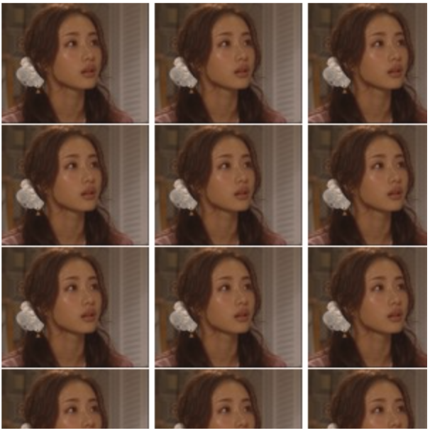

+ 背景图平铺方式：`background-repeat: attr;`

  + attr 取值如下：

    + repeat（默认值，按水平和处置方向均匀平铺）

    + no-repeat（不平铺）

      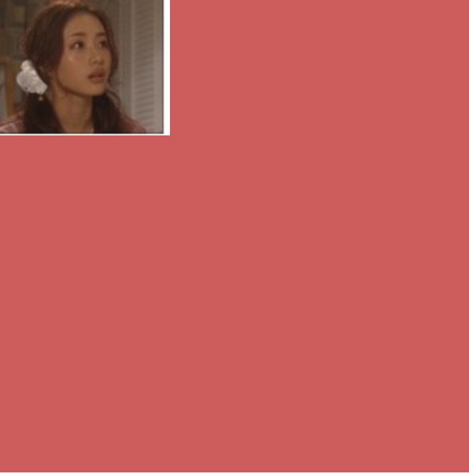

    + repeat-x（沿x轴水平平铺）

      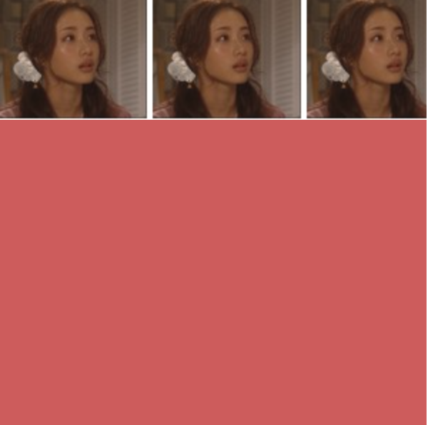

    + repeat-y（沿y轴垂直平铺）

      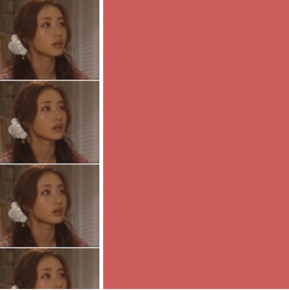

+ 背景图位置控制：`background-position: 水平位置 垂直位置;`

  + 取值（可以混用，见例子3）：

    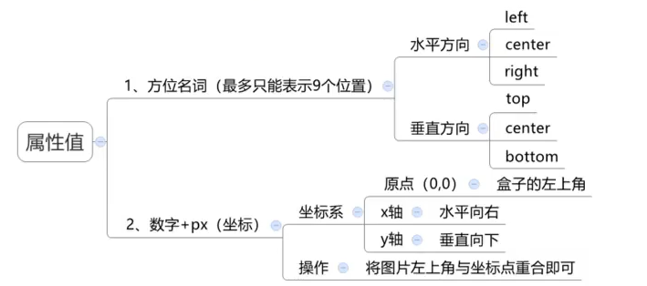

  + 举例：

    + `background-position: center center;`

      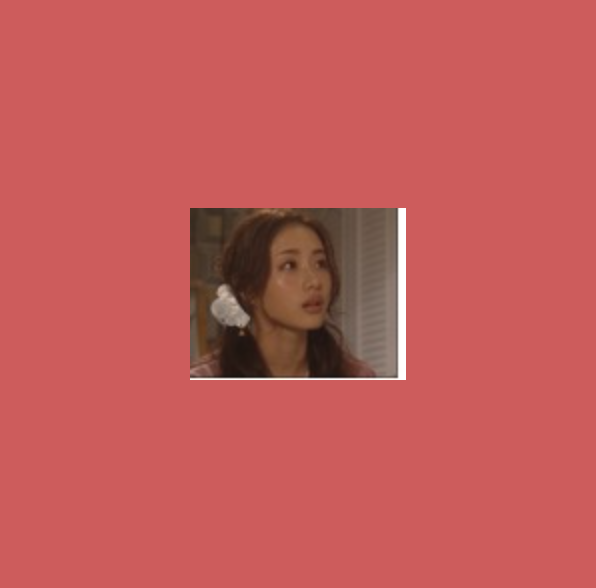

    + `background-position: 100px 200px;`

      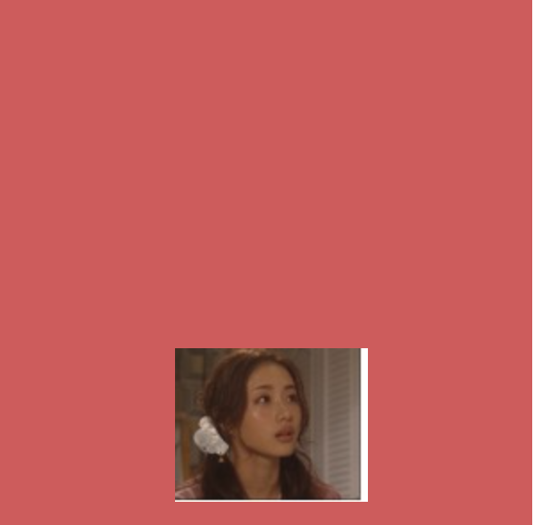

    + `background-position: right 100px;`

      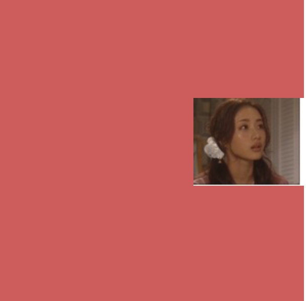

+ 背景图复合属性：`background: color image-url repeat position/size `

  + 此复合属性，属性值没有顺序规则，并且可以任意缺省，但是注意position包括 position-x、position-y是一个属性值的值对，不可拆开（即中间不能插入别的属性值，如果position使用单词，那么可以x、y顺序互换，如 bottom left就是y x顺序），注意size和position之间不是用空格分隔，position和size可以连写
  
+ 背景图大小: `background-size: <width> <height> | contain | cover`

  + 取值解释：
    + `<width>、<height>`可以取 数字 px 或者 百分比
    + contain：等比例缩放到不超过盒子，但是若原图尺寸小于盒子尺寸，则不会拉伸不会填满盒子
    + cover：等比例缩放图片直至填满整个盒子没有空白，图片尺寸大于盒子，则可能导致图片显
    + 因此，通常把盒子尺寸设置成与图片尺寸等比例
  
+ 渐变背景参考<a href="#bgi">后文</a>


### 元素（标签）显示模式 

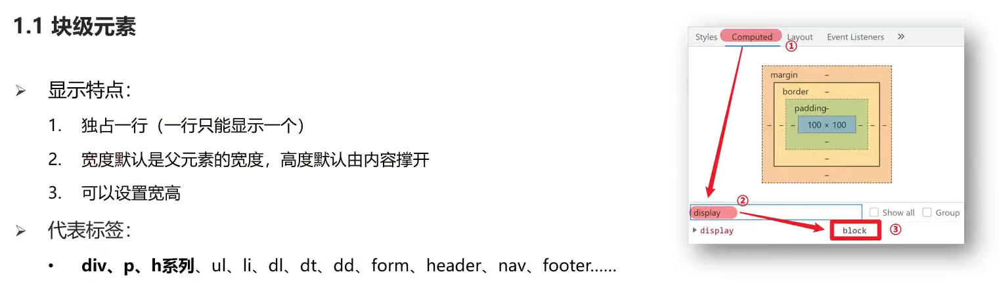

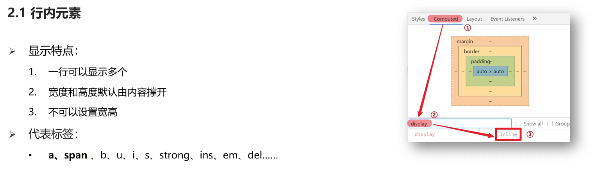

  注意几个常见的<a name="t3">行内标签</a>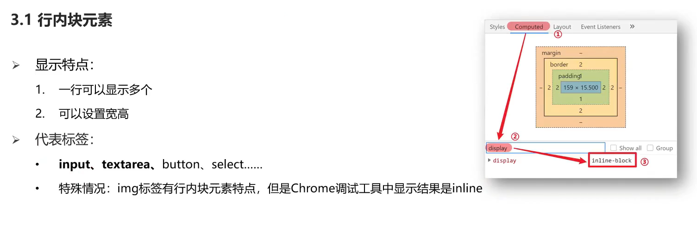

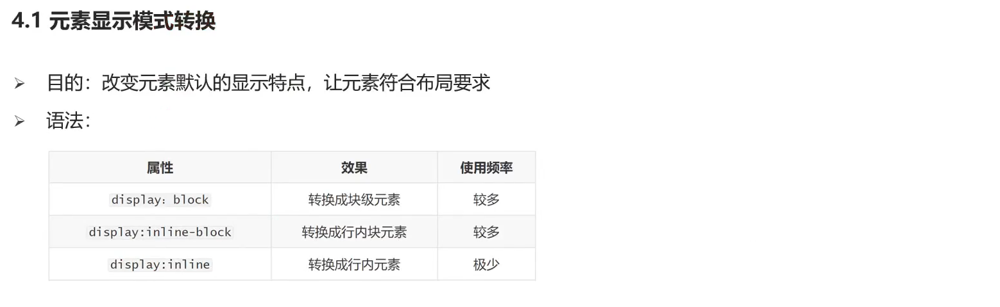

举例：

```html
/* css file */
div.default {
    width: 100px;
    height: 100px;
    background-color:blueviolet;
}

span.default {
    width: 100px;
    height: 100px;
    background-color: pink;
}
div.class1 {   
    width: 100px;
    height: 100px;
    background-color:blueviolet;
	display: inline-block;
}
span.class2 {
    width: 100px;
    height: 100px;
    background-color: pink;
	display: block;
}

<!-- html file -->
<div class="default"> content here</div>
<div class="default"> content here</div>
<hr>
<span class="default"> content here </span>
<span class="default"> content here </span>
<hr>
<div class="class1"> content here</div>
<div class="class1"> content here</div>
<hr>
<span class="class2"> content here</span>
<span class="class2"> content here</span>
```

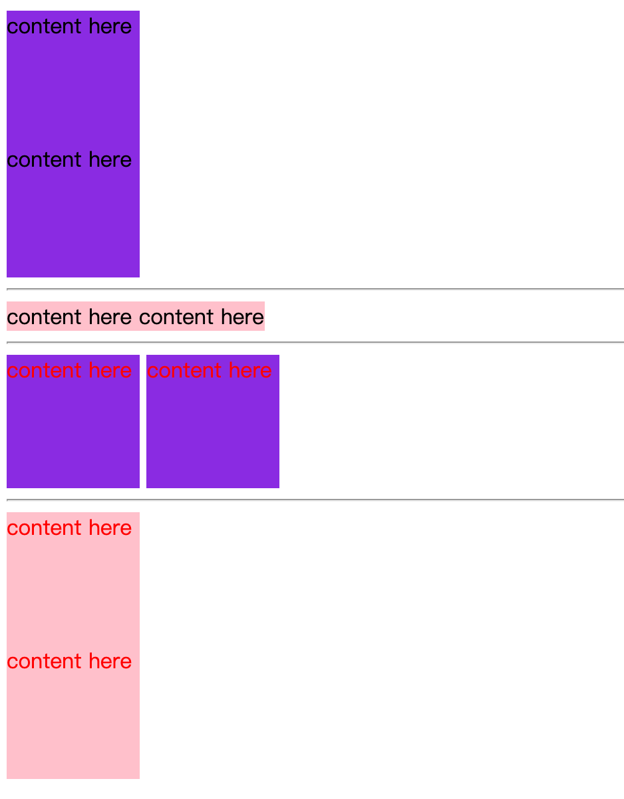

### 嵌套规范

+ 块级元素一般作为大容器，可以嵌套：文本、块级元素、行内元素、行内快元素,etc.
  + 但是：p、h标签内不要嵌套 div、p、h等其他块级元素
+ a 标签内部可以嵌套任意元素
  + 但是：a标签不能嵌套其他a标签


### CSS的特性

#### CSS 继承性

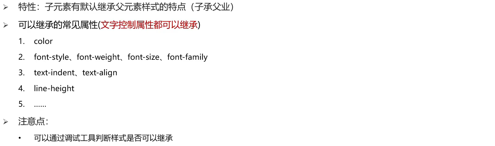

以下情况继承性不适用：

+ 元素本身有自己的属性，则不继承父元素同类型的属性
  + 例如：a标签、h1～6标签，这些本身有字体/颜色属性

#### CSS 层叠性

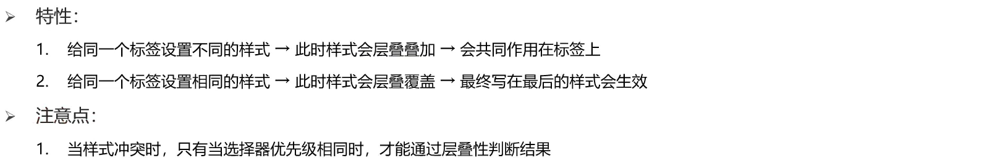

相同样式参见<a href="#t2">例子</a>，不同样式参见以下代码：

```html
/* css file */
div {
	color: red; /* 生效 */
}
.class1 {
	font-size: 7px; /* 生效 */
}
<!-- html file -->
<div class="class1"> content here </div>
```

#### CSS 优先级

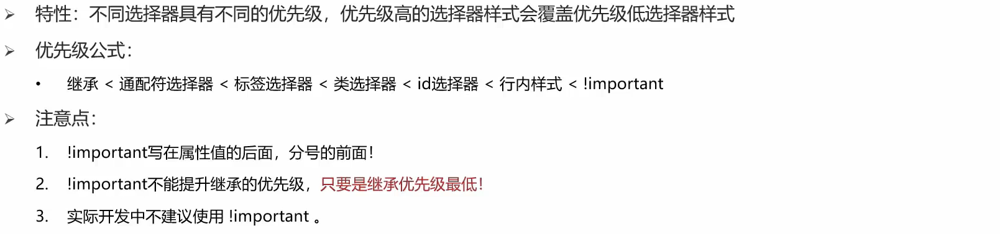

+ 精度越高，定位的范围越小的选择器优先级越高
+ 行内样式即写在标签上的css样式，<a href="#s">参见</a>
+ !important 用法举例：`.class { color: red !important;}`

**优先级权重叠加计算**

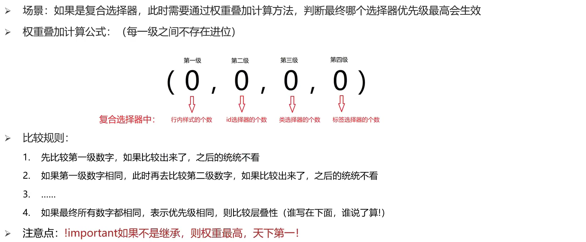

+ 如果都是继承级别，那就看继承的哪个父级类别更近（“血缘关系更近”，如下例子），同级别则就层叠性生效，谁后写谁生效

  ```html
  /* css file */
  div p { 
  	color: red;
  }
  .father { 
  	color: gray;
  }
  <!-- html file -->
  <div class="father">
  	<p class="son">
  		<span> content here </span> <!-- 字为红色，继承自父级 p 标签 -->
  	</p>
  </div>
  ```

### 盒子模型

**盒子模型的作用：实现网页布局**

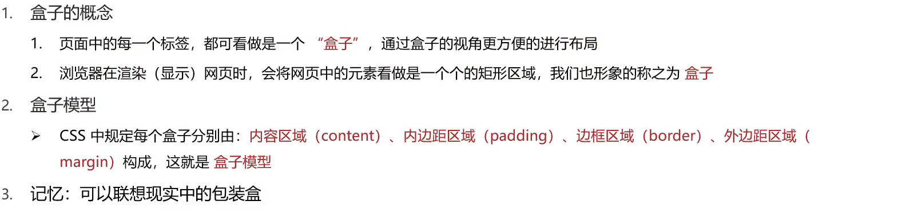

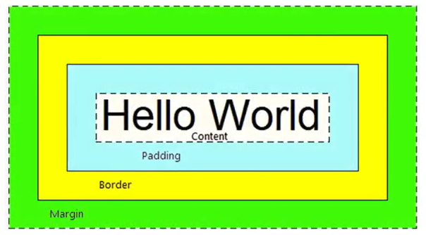

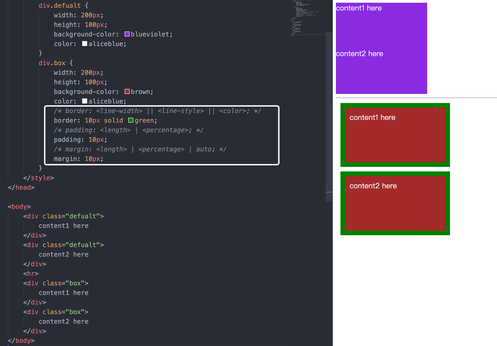

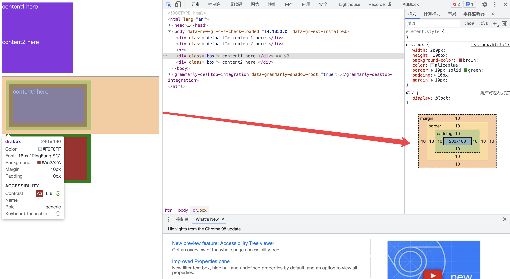

+ **content区域：**

  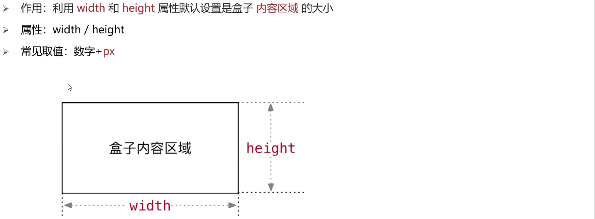

+ **border区域：**

  + 复合属性：`border: <line-width> || <line-style> || <color>;`

  + 注意 `||`表示并且，实际写代码时用空格隔开不同属性值，属性值间无顺序之分

    `border: 10px solid green;`

  + 以上是四周都会添加border的写法，可以用如下代码设置单独某边的border：

    + `border-top: <line-width> || <line-style> || <color>;`
    + `border-bottom: <line-width> || <line-style> || <color>;`
    + `border-left: <line-width> || <line-style> || <color>;`
    + `border-right: <line-width> || <line-style> || <color>;`

  + 其余分开设置的属性：

    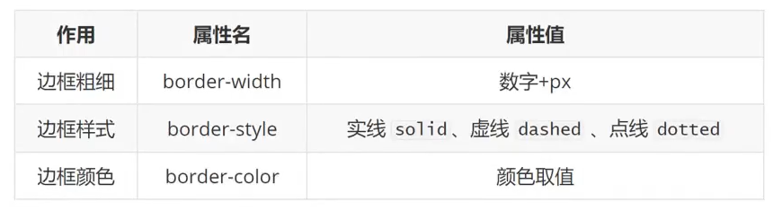

  + 注意，加了border之后，盒子会被撑大，盒子尺寸就不光是 width x height 了，还要算上 border- width

  + **==注意：background-color 给border内部区域上色（即padding也会被上色）==** 

+ **padding区域：**

  + `padding: <length> | <percentage>;`
  + 注意 `|` 表示或者，lenght用 数字px，percentage用 数字%
  + padding 可以作为复合属性，设置不同方向的属性值：
    + `padding: top right bottom left` （顺时针），若缺失则缺失的方位对称补齐：
      + `padding: 10px 20px` = `padding: 10px 20px 10px 20px`
      + `padding: 10px 20px 30px` = `padding: 10px 20px 30px 20px`
    + 可以拆开成：padding-top、padding-right、padding-bottom、padding-left 分别设置

+ **margin区域：**

  + 方法和 padding 完全一致

  + ==版心居中：`margin: 0 auto;` 表示 上下外边距0，左右自动，且仅对 块级元素 适用==

  + 一些可能的问题：

    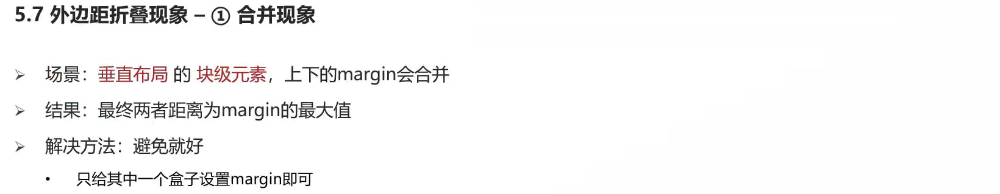

    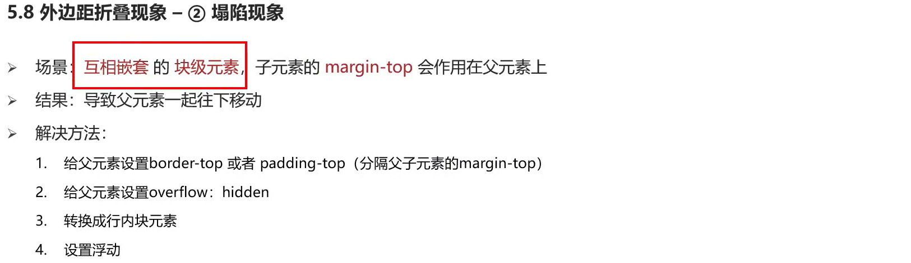

    + 此外，无法通过设置 margin 或 padding 来改变 **行内元素** 的 **垂直** 位置，即设置<a href="#t3">行内标签</a>的 margin-top/margin-bottom/padding-top/padding-bottom 不会生效，如果想改变垂直位置，可以通过设置 line-height 生效（或者改元素显示模式为 display:inline-block 再设置 margin 或 padding）

+ **自动内减（CSS3支持）：**

  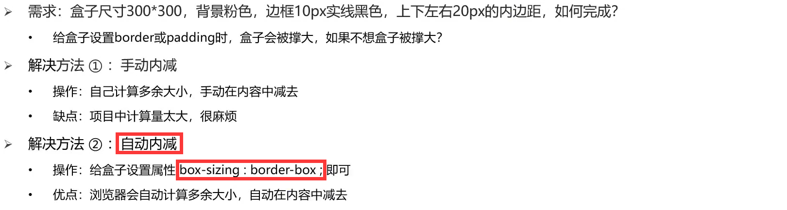

  + ==启用 box-sizing属性（开启内减模式）后，盒子的大小会自动调整为设置的 width x height 大小，此时的 width、height就不是内容的大小了==

+ 盒子尺寸计算公式：

  + ```latex
    box-area = ( width + border-left + padding-left + border-right + padding-right) x 
    		   ( height + border-top + padding-top + border-bottom + padding-bottom )
    ```

  + 注意width、height等都可以不加的，不加的话默认就由 标签内容来撑开

+ **清楚默认内外边距：**

  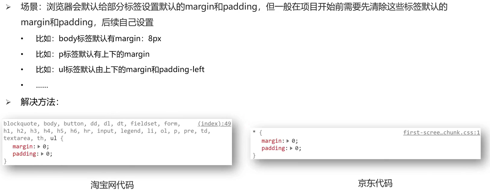

  

### 结构伪类选择器

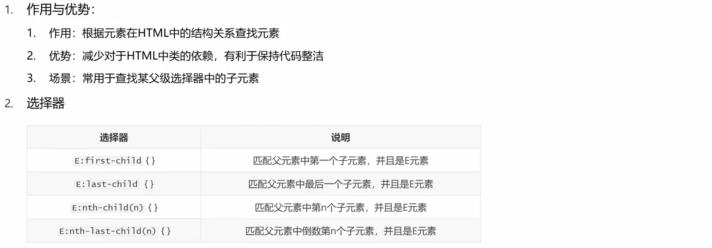

+ 以上的 E 代指其他各种选择器，注意默认序号从1开始计数，举例如下：

  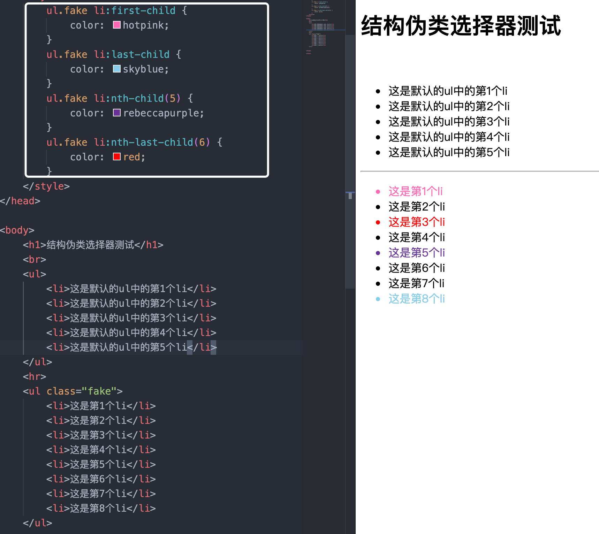

+ 注意以上的n不仅可以取数字（若取0那就是不选，等于白写），还可以取以下公式（注意只能用n做公式自变量）：

  + 选取偶数项：2n、even，举例：`ul.fake li:nth-child(2n/even)`
  + 选取奇数项：2n+1、2n-1、odd
  + 找到前5个项（含第5项）：-n+5【注意写成 5-n 是不生效的】
  + 找到从第五个往后的所有项（含第5项）：n+5 【同理写成 5+n 也是不生效的】
  + 选取所有项：n、n+k、n-k
  + 通用公式，选取 kn+b 项（其中k、b要替换成具体的数字，k、b可以为负数）：kn+b
    + 执行时的原理就是，n**从0**开始遍历（遍历到无法选出新项为止），公式计算结果为正数的为选中项，0和负数不选中
    + 通项n必须放在前面，即 b+kn、nk+b 均无法识别成功
    + 把这个理解成 数组的通项公式就好了


### 伪元素

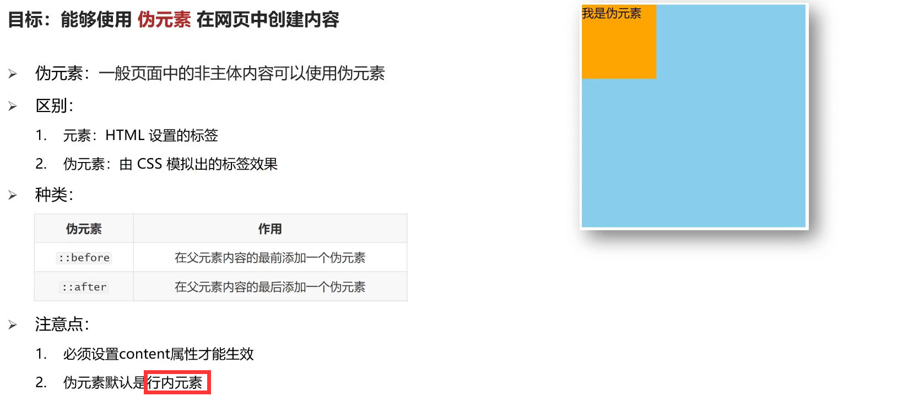

+ 注意伪元素是通过css代码生成的，举例如下：

  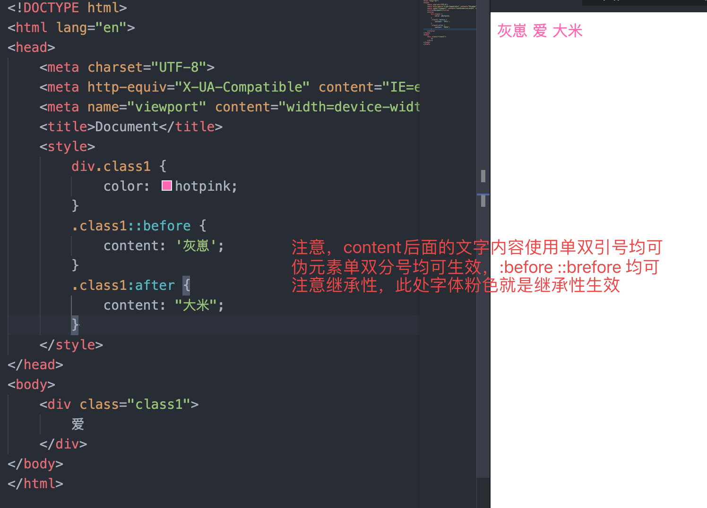

  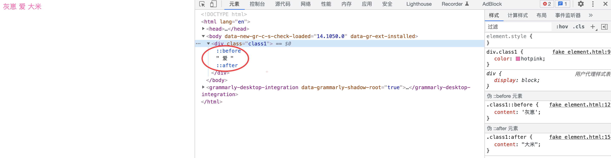

+ 伪元素（标签）和普通标签一样，可以添加各种属性：

  ```css
  .class1::before {
  	content: "灰崽"; /* content必须添加，不添加伪元素不会生效，若没有内容可以写一个空引号"" */
  	color: gold;
  	background-color: black;
  	width: 100px;
  	height: 100px; /* 伪元素为行内元素，width、height默认不生效，下面设置display进行生效 */
      display: inline-block; /* 注意默认的伪元素是 行内元素（即display:inline）*/
  }
  ```

+ 伪元素注意事项：
  + hover伪元素必须要紧跟在前一个选择器之后，不能留有空格
    + `.class-name:hover { attrs }` 正确
    + `.class-name : hover {attrs}; `、`.class-name: hover {attrs}` 、`.class-name :hover {attrs}` 都错
  + 伪元素以 `::`开头，可以写多个写，但一般要跟在一个具体选择器之后，以确定伪元素添加在哪个元素中
    + `.class1::before, .class2::before {attrs};` 并集选择器选两个伪类进行设置

### 网页布局方式

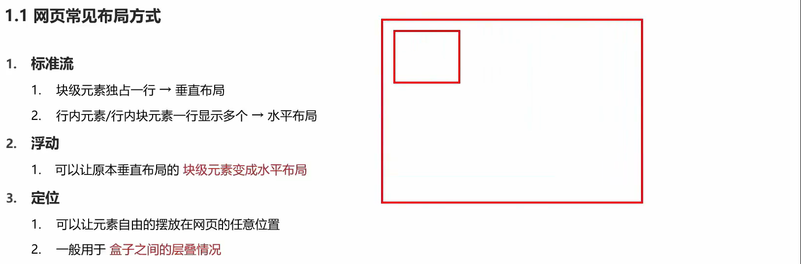

### 标准流

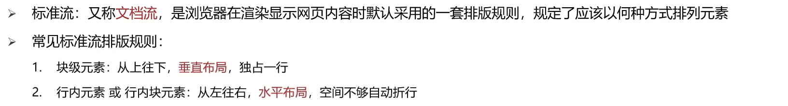

> 标准流的排版方式，又称为：文档流/普通流，所谓的文档流，指的是元素排版布局过程中，元素会自动从左往右，从上往下的流式排列。
>
> + 浏览器默认的排版方式就是标准流排版方式
>
> + 在CSS中将元素分为三类：分别是
>   + 块级
>   + 行内
>   + 行内块级
>
> + 在标准流中有两种排版方式，一种是垂直排版，一种是水平排版
>   + 垂直排版，如果元素是块级元素，那么就会垂直排版
>     水平排版，如果元素是行内元素或行内块级元素，那么就会水平排版
>
> 参考：[CSS—网页布局（标准流，浮动流）](https://www.cnblogs.com/guojieying/archive/2020/09/18/13691360.html)

### 浮动

浏览器解析行内块或行内标签的时候，若源代码中两标签换行书写，则解析显示时会产生一个空格的距离，如下：

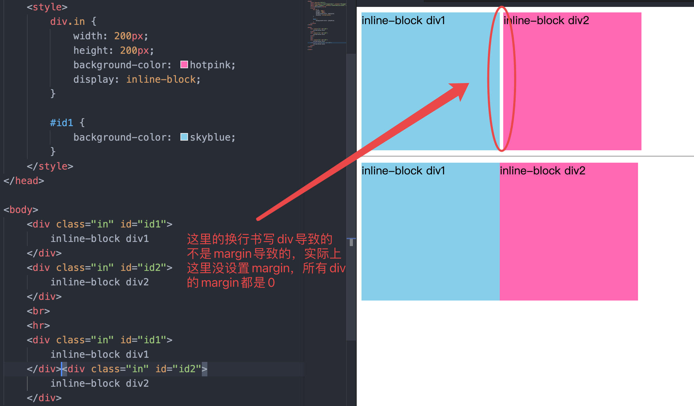

以上问题，可以通过css浮动解决，两个都添加 `float: left;` 即可

**浮动的基本作用：**

+ 图文环绕
+ 网页精准布局（提高网页布局的灵活度和自由性）

**浮动的特点：**

+ 设置浮动的元素灰[半脱离标准流（半脱标）](https://www.cnblogs.com/guojieying/archive/2020/09/18/13691360.html)，不占标准流位置
  + 因此，跟在该浮动元素后面的标准流元素将顶上，占用原本浮动元素未浮动前该占有的标准流位置
+ 浮动元素比标准流高半个级别，可以覆盖标准流中的元素
  + 这样的结果往往会呈现浮动元素漂浮在后面跟着的元素上方，但是不会盖住后面元素的文字，文字会环绕浮动元素显示
+ 下一个浮动元素会在上一个浮动元素的左右浮动（浮动找浮动）
+ 浮动元素可以在一行显示多个，并且合一设置宽高（即浮动元素具备行内块元素特点）
+ 浮动元素设置`margin: 0 auto; / text-align:center;`无法生效，但可以分别去设置margin-up/bottom/left/right
+ 浮动元素如果在一行排列时，其父级宽度不够，则浮动元素会自动换行进行排列

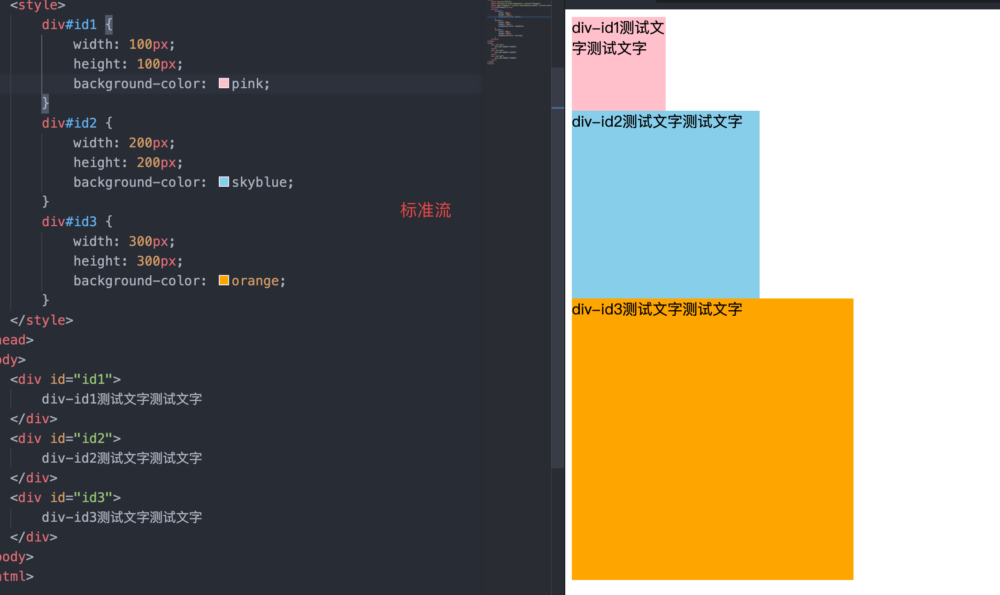

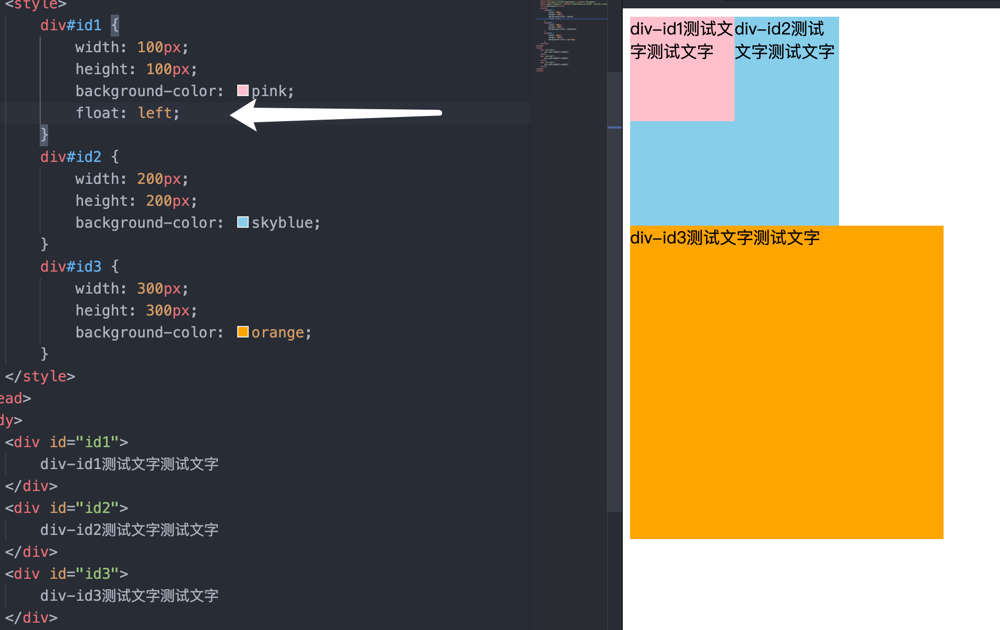

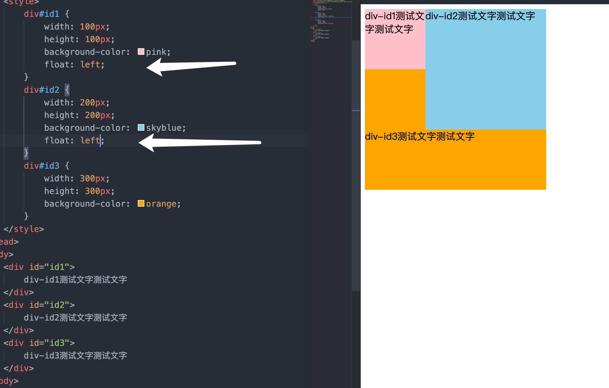

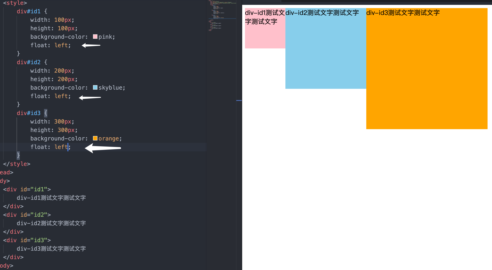

**清除浮动：**

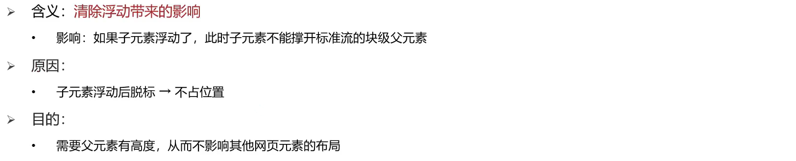

+ 解释：浮动元素不占标准流位置，因此不会撑开父元素所在盒子，<a name="eg1">例子</a>如下

  ```html
  <style>
      .ftop {
          margin: 0 auto;
          width: 1000px;
          /* height: 300px; */
        	/* 父元素没设置高度，浮动的子元素是撑不开父元素的 */  
          background-color: pink;
      }
      .fleft {
          float: left;
          width: 200px;
          height: 300px;
          background-color: #ccc;
      }
      .fright {
          float: right;
          width: 790px;
          height: 300px;
          background-color: skyblue;
      }
      .fbottom {
          height: 100px;
          background-color: green;
      }
  </style>
  <body>
      <div class="ftop">
          <div class="fleft"></div>
          <div class="fright"></div>
      </div>
      <div class="fbottom"></div>
  </body>
  ```

  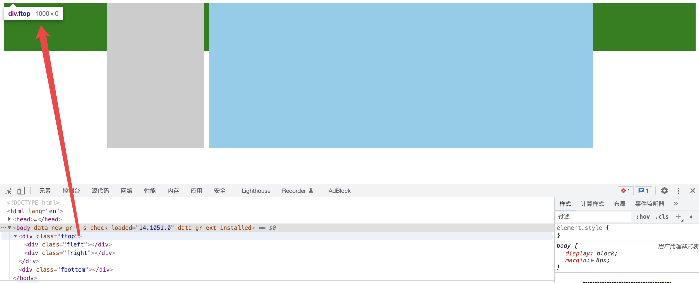

  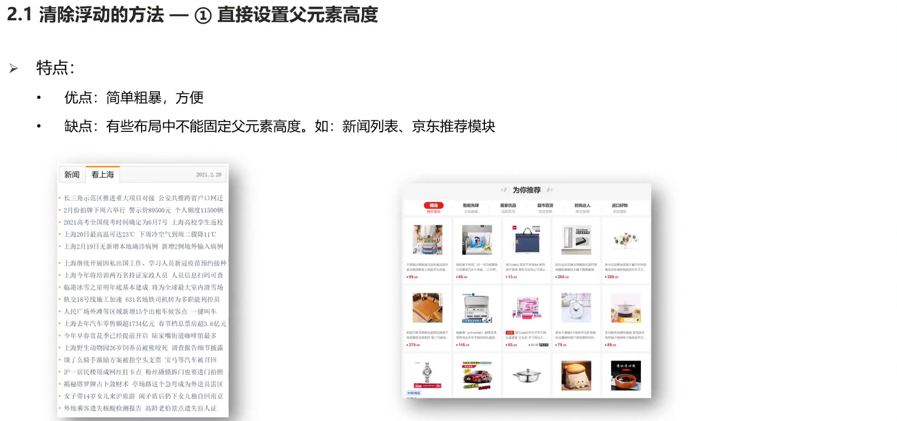

  + 即设置父元素 height 属性

  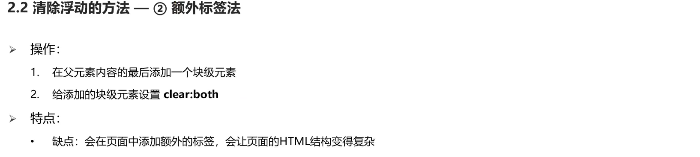

  + 以<a href="#eg1">该例</a>代码为例，父元素添加：

    ```html
    /* css 处添加代码 */
    .clearfix {
    	/* 清楚左右两侧浮动的影响，可以只清除一侧left/right，一般直接用both */
    	clear: both;
    }
    
    <!-- html部分修改-->
    <div class="ftop">
    	<div class="fleft"></div>
    	<div class="fright"></div>
    	<!-- 在父元素内容的最后添加一个块级元素, 统一起类名为clearfix -->
    	<div class="clearfix"></div>
    </div>
    <div class="fbottom"></div>
    ```

  + 一般不使用这种方法来清除浮动，会增加额外标签

  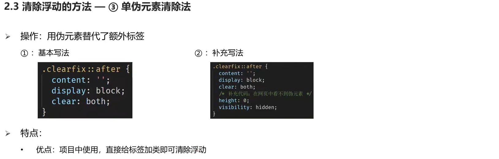

  + 以<a href="#eg1">该例</a>代码为例，父元素添加：

    ```html
    <style>
    /* css 处添加以下代码 */
    .clearfix::after {
        content: '';
    	/* 默认的伪元素为inline模式无法设置宽高，这里要改成block */
        display: block;
        clear: both;
    	/* 以上为基本写法，但是加上以下代码更佳，可以使得网页中看不到伪元素 */
    	/* 在高版本浏览器中，这两行加不加一样，用于兼容低版本浏览器 */
    	height: 0;
    	visibility: hidden;
    }
    </style>
    
    <!-- html 部分修改 -->
    <!-- 父级标签添加 clearfix 类名，-->
    <div class="ftop clearfix">
        <div class="fleft"></div>
        <div class="fright"></div>
    </div>
    <div class="fbottom"></div>
    ```

  + 实际上就是利用伪元素创建了一个带clear的额外标签

  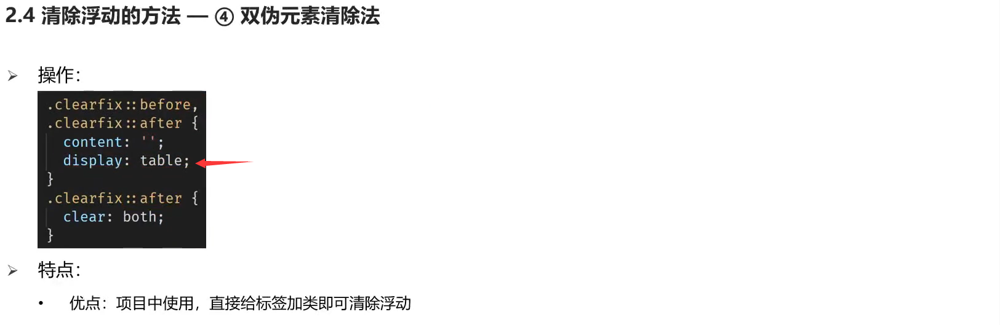

  + `display: table;` 此元素会作为块级表格来显示（类似 `<table>`），表格前后带有换行符。

    + 更多显示模式取值参考：[CSS display 属性](https://www.w3school.com.cn/cssref/pr_class_display.asp)

  + 以<a href="#eg1">该例</a>代码为例，父元素添加：
  
    ```html
    <style>
    /* .clearfix::before 作用是解决外边距塌陷问题：
       外边距塌陷：父子标签都是块级，子级标签加margin会影响父标签位置
    */
    .clearfix::before,
    .clearfix::after {
        content: '';
        display: table; /* 注意改显示模式为 table */
    }
    .clearfix::after {
    	clear: both;
    }
    /* 以上代码可被以下注释掉的代码替代，但是一般用上面的 */
    /* .clearfix::after {
    	content: '';
    	display: table;
    	clear: both;
    }
    */
    </style>
    
    <!-- html 部分修改 -->
    <!-- 父级标签添加 clearfix 类名，-->
    <div class="ftop clearfix">
        <div class="fleft"></div>
        <div class="fright"></div>
    </div>
    <div class="fbottom"></div>
    ```
  
  + 也是利用伪元素，不过这里多了一些细节，详见上述示例代码
  
  + **注意双伪元素的方法不仅能清除浮动，还能解决外边距塌陷问题**

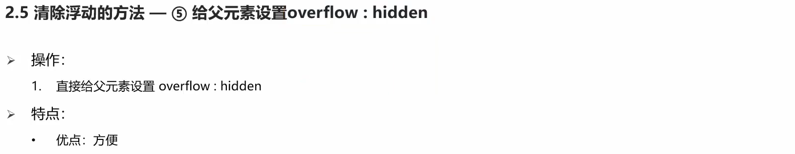

+ 以<a href="#eg1">该例</a>代码为例，给父元素添加overflow属性：

  ```html
  <style>
      .ftop {
          margin: 0 auto;
          width: 1000px;
          /* height: 300px; */
        	/* 父元素没设置高度，浮动的子元素是撑不开父元素的 */  
          background-color: pink;
          /* 清除浮动影响 */
          overflow: hidden;
      }
  </style>
  <body>
  	<!-- html 不改代码-->
      <div class="ftop">
          <div class="fleft"></div>
          <div class="fright"></div>
      </div>
      <div class="fbottom"></div>
  </body>
  ```

**浮动就会脱标，需要清除浮动的影响，但更好的结局方案，是使用 flex 布局模式**


### 定位

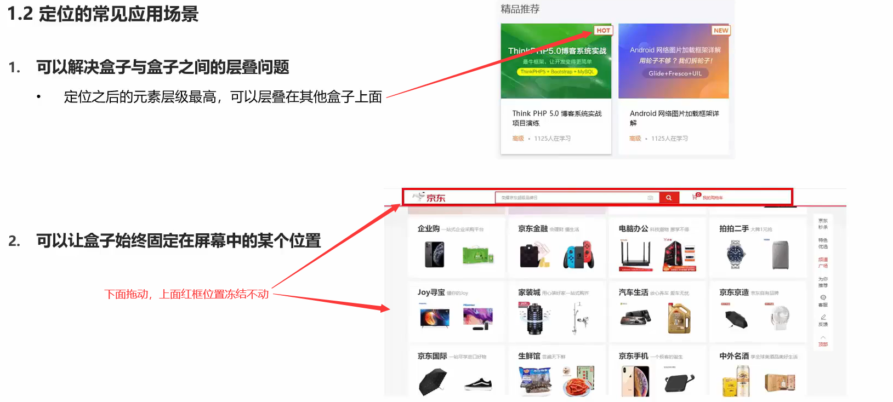

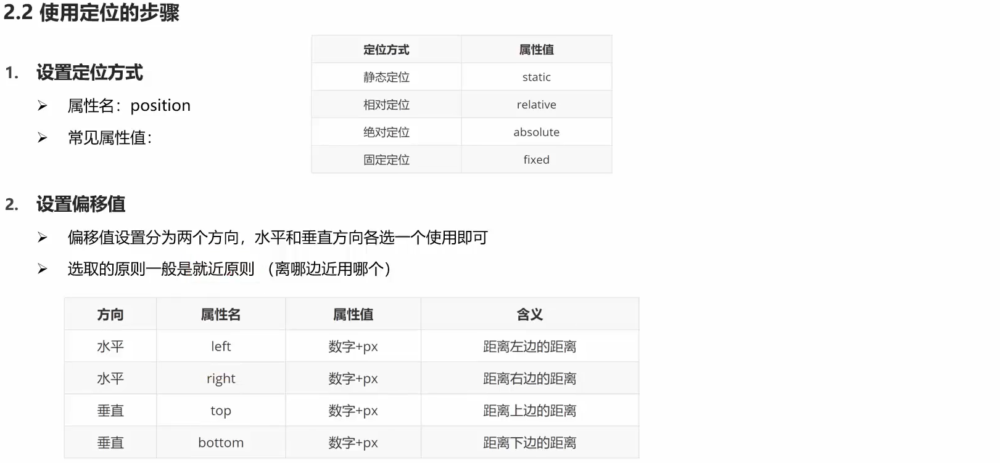

+ 注意位置不是position的属性值，是独立的属性

  ```css
  position: static｜relative｜absolute ｜fixed;
  left: <num> px;
  right: <num> px;
  top: <num> px;
  bottom: <num> px;
  /* 一般设置了left就不设置right，同理top 
     如果都设置了，left和top优先
  */
  ```

#### 静态定位

默认定位值，一般的标签元素不加任何定位属性都属于静态定位，在页面的最底层属于标准流。

> HTML 元素默认情况下的定位方式为 static（静态）。
>
> 静态定位的元素不受 top、bottom、left 和 right 属性的影响。

#### 相对定位（占位）

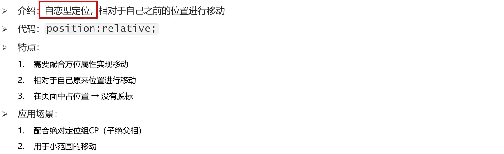

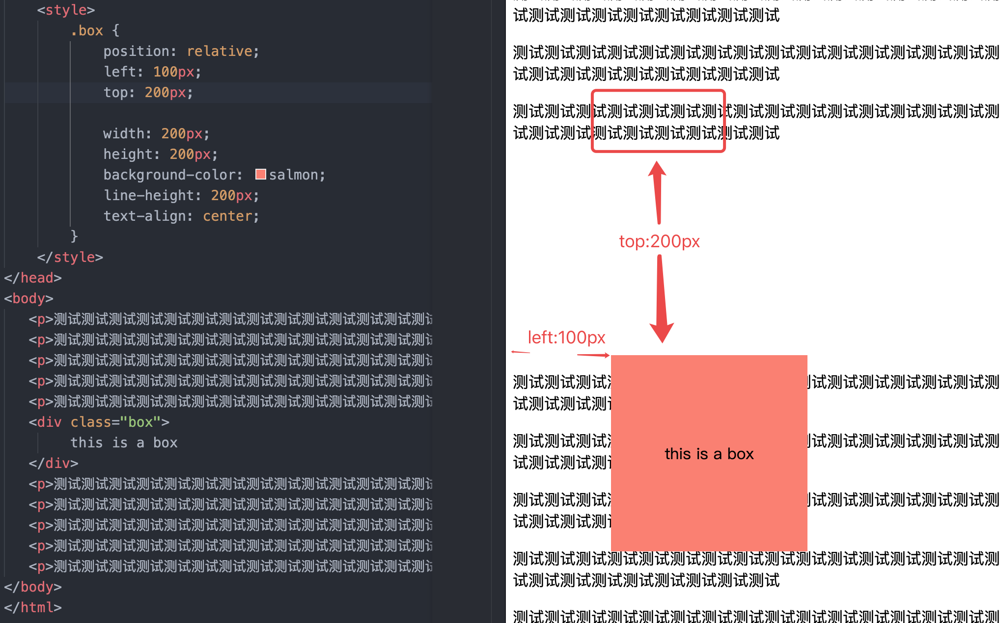

+ 注意：
  + 相对定位原始位置继续占用，相对位置根据原始位置定位
  + 并且相对定位的标签仍然具有原有的显示模式特点（display: block, etc.）

#### 绝对定位（不占位）

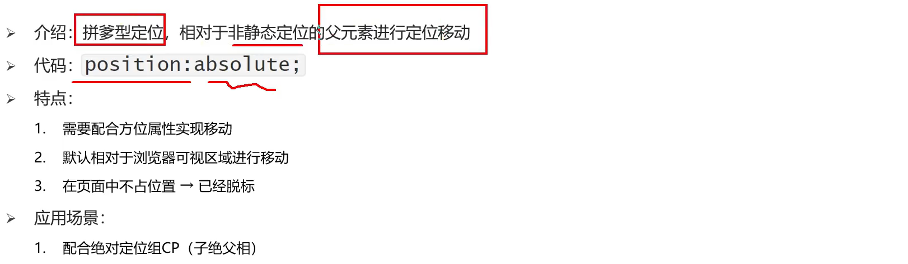

+ 以下是没有父元素（或者说父元素为body）的绝对定位情况：
  + 注意absolute的盒子为inline-block属性，不占标准流位置了，同时上图没有设置位置偏移值（left,etc.）所以在原位置，然后变成行内块了，不占一行的位置了，后面的p标签内容就堆上来	

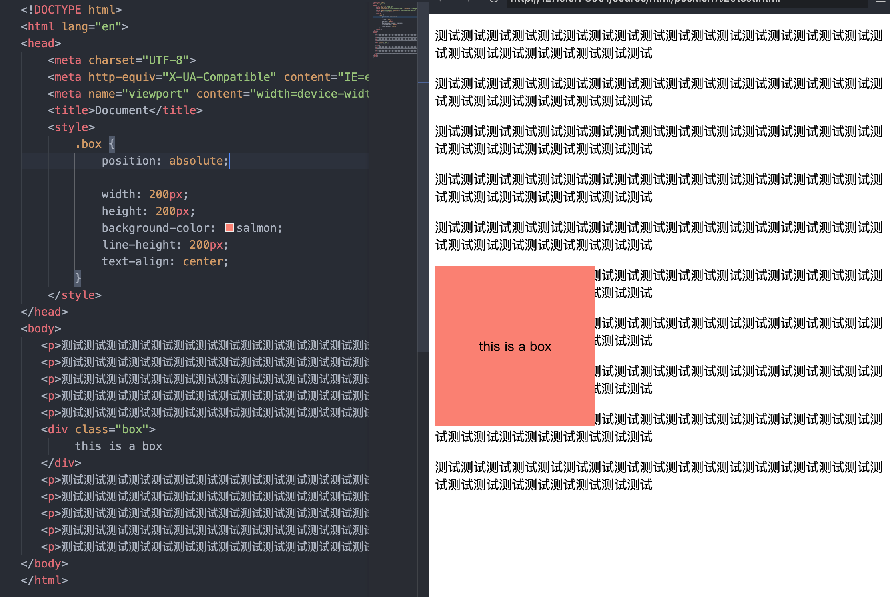

+ 以下是有父元素，但是父元素没有定位（也即默认的static定位）

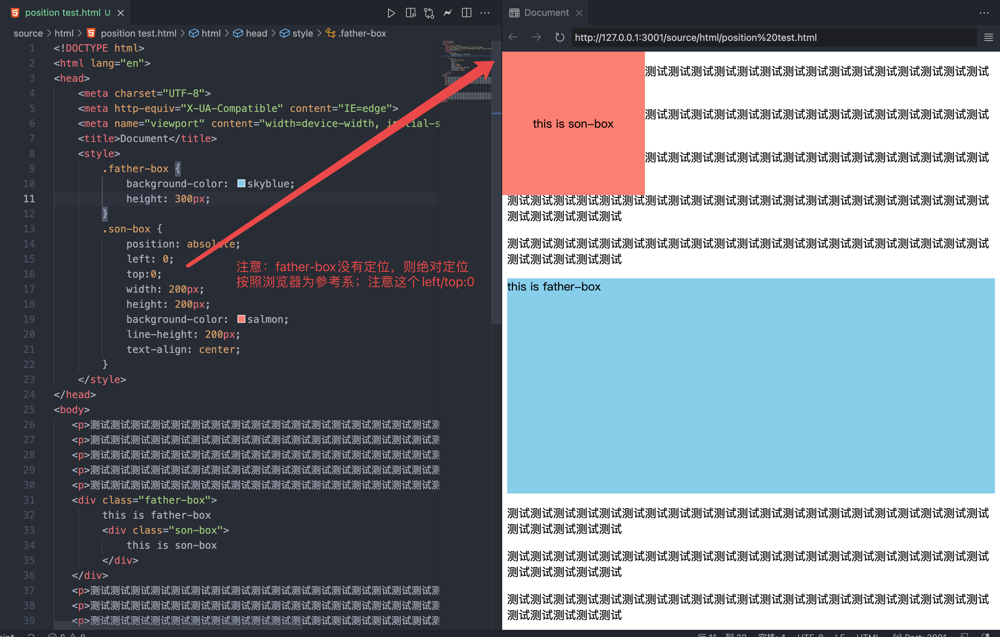

+ 以下是子元素绝对定位，父元素相对定位的情况

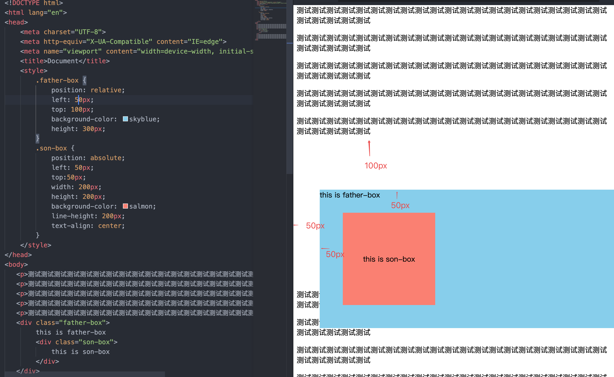

+ 绝对定位特点：

  + 先找已定位的父元素，若有则以该父元素所在位置为参考系进行定位；若无，则已浏览器窗口为参照系
  + 绝对定位的元素脱离标准流，不占位
  + 绝对定位会改变元素显示模式特点，绝对定位的元素拥有inline-block的特点
  + 绝对定位逐层查找父级定位元素，就近原则
  

#### 有绝对定位的盒子居中问题

+ 绝对定位（absolute）的盒子，使用 `margin: 0 auto;` 无法实现居中效果【relative默认是可以用margin居中的】

  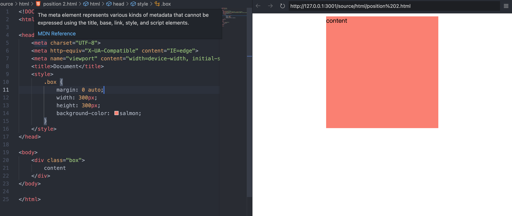

  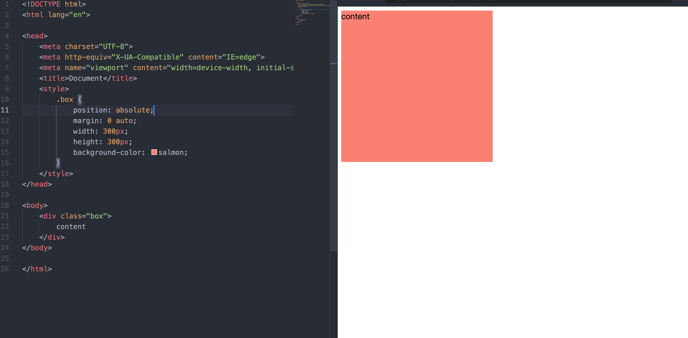

  + 如果想要让绝对定位的盒子居中，采用如下方式（方法1）

    ```css
    position: absolute;
    /* 水平居中设置 */
    left: 50%;
    margin-left: -<width_num/2> px; /* 该盒子width的一半 */
    /* 或者
    right: 50%
    margin-right: -<width_num/2> px;
    */
    /* 垂直居中设置 */
    top: 50%;
    margin-top: -<height_num/2> px; /* 该盒子height的一半 */
    /* 或者
    bottom: 50%;
    margin-bottom: -<height_num/2> px;
    */
    /* 盒子大小设置 */
    width: <width_num> px;
    height: <height_num> px;
    ```

    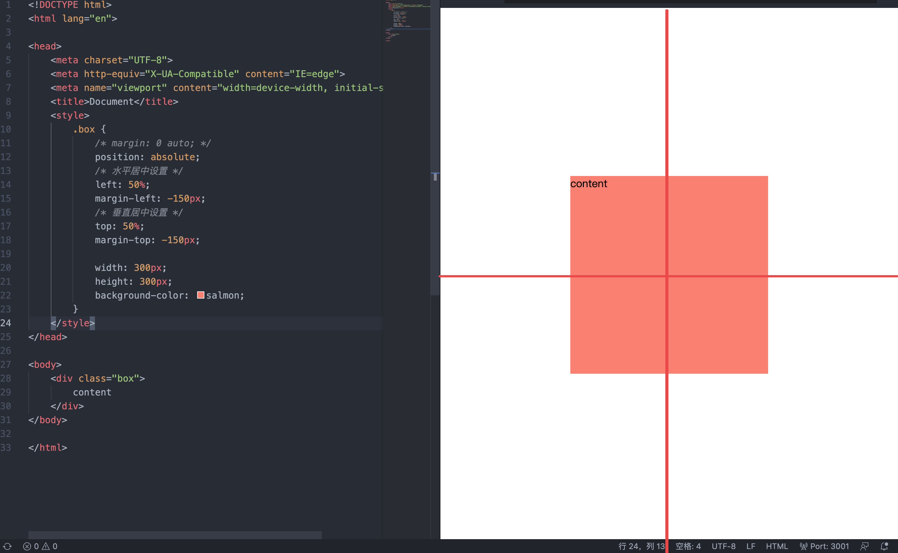

  + 至于为啥直接50%不可以，是因为50%是以盒子的最左边和最上边作为参考的，因此还需要通过设置margin进行调整，如下：

    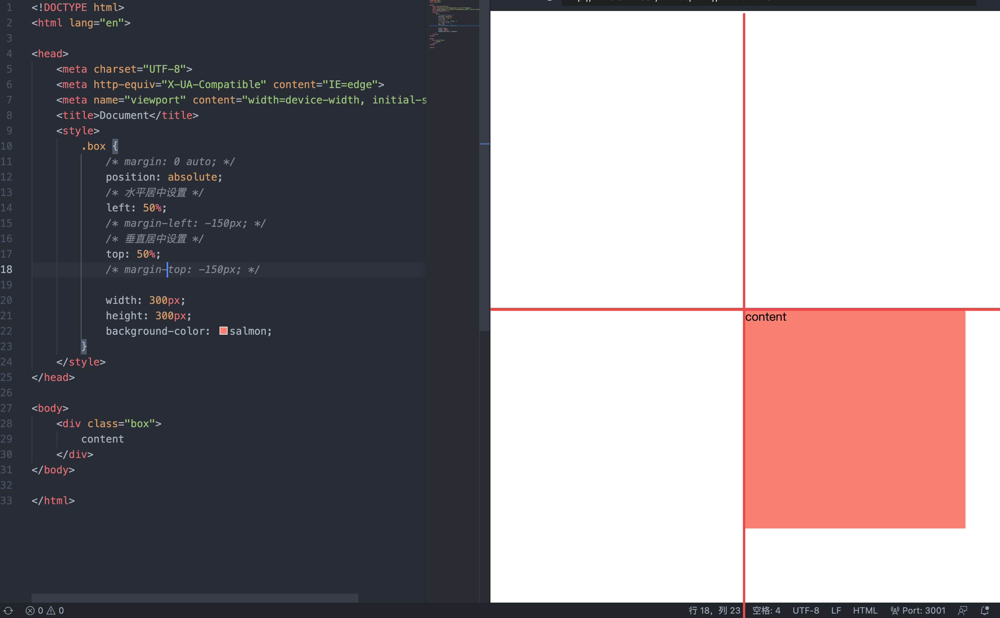

  + 至于为啥是设置负值，而不是直接margin-right，参见如下：

    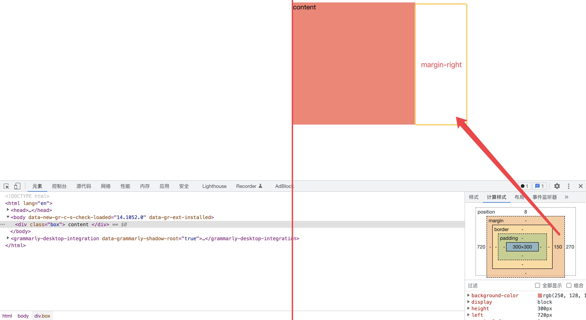

  + 除了以上的<a name='trans'>方法</a>之外，可以采用transform，进行自动计算：

    ```css
    position: absolute;
    left: 50%;
    top: 50%;
    /* 设置位移，自动计算取宽高的-50% */ 
    transform: translate(-50%, -50%);
    /* 盒子大小设置 */
    width: <width_num> px;
    height: <height_num> px;
    ```

#### 固定定位

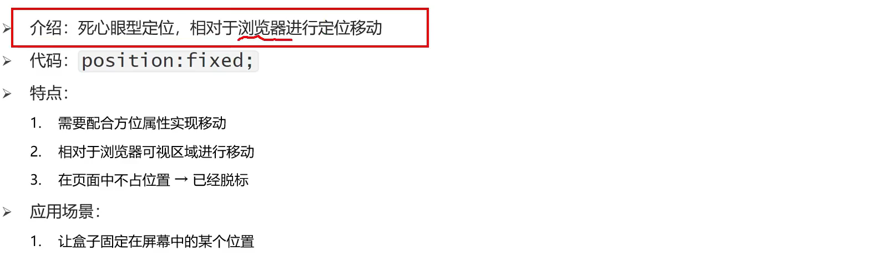

+ fixed定位就类似于冻结，滚动网页页面仍然在固定位置
+ 固定定位特点：
  + 脱标，不占标准流位置
  + 以浏览器窗口为参考系定位
  + 具备inline-block的显示特点

### 元素的层级关系

+ 不同布局方式元素的层级关系：`定位 > 浮动 > 标准流`
  + 即定位覆盖在最上层，标准流在最底层
+ 不同定位方式的层级关系：
  + 相对（relative）、绝对（absolute）、固定（fixed）定位的默认层级（即不添加`z-index`时）相同
    + 后写的元素层级更高，即谁后写，谁的层级高，覆盖在先写的元素上面
  + 可以通过加`z-index` 属性来设置层数，控制其所在层
    + `z-index` 属性值取整数，不带任何单位，数字越大，层数越高，显示得越上面
    + 若不设置`z-index`，则默认值为0
    + `z-index`必须配合定位才生效，没设置定位的元素设置`z-index`无效

### 装饰

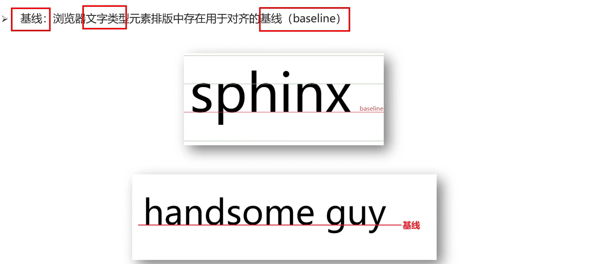

+ 浏览器在解析显示 inline、inline-block 元素时，默认按照文字排版进行解析显示，即按照一个基线进行排版对齐
+ 文字通常会有一部分显示在基线下方，因此图片等其他inline、inline-block元素与文字一行排列时，底部往往不对齐
  + 通过设置垂直对齐方式进行解决

#### 垂直对齐方式

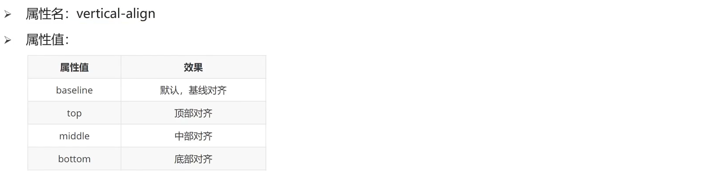

注意，若设置vetical-algin没有生效，可以考虑有没有设置line-height，通常vetical-algin需要配合line-height生效

例子（**==尤其注意案例4、5==**），[源码点击此处](./source/html/vertical-algin.html)：

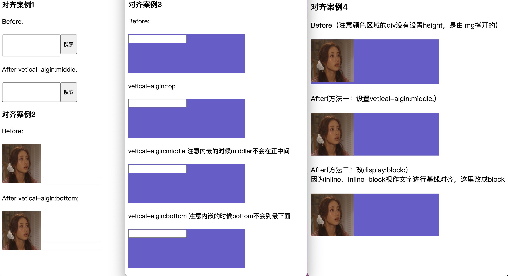

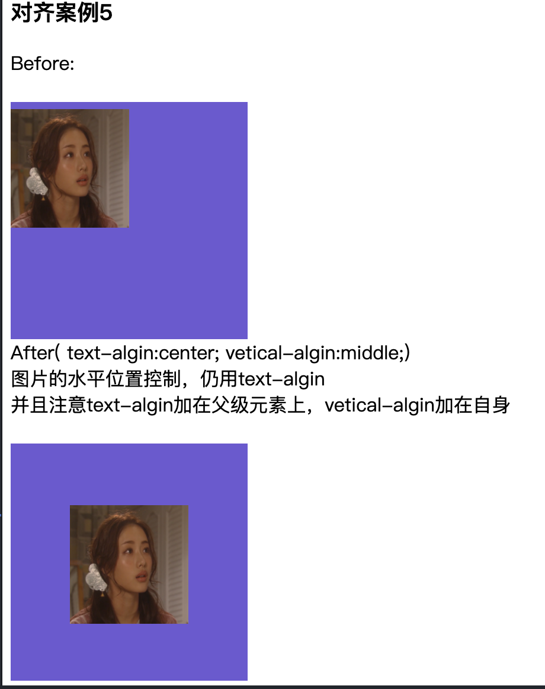

#### 光标类型

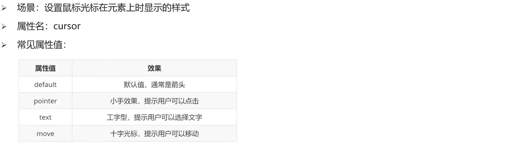

#### 边框圆角

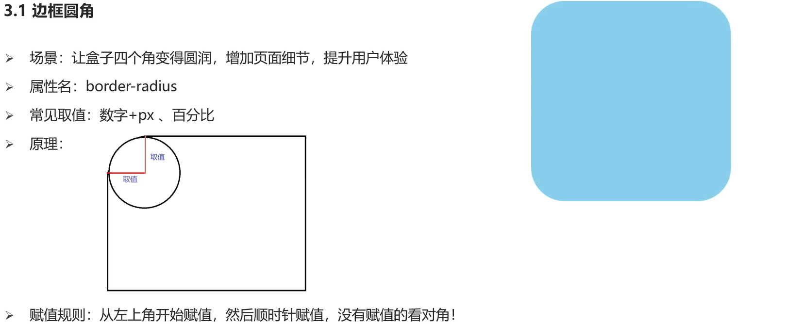

+ 几种特殊的形状：

  + 正圆：`width=height、border-radius=50%`
  + 胶囊形状：`width>height、border-radius=height/2`

  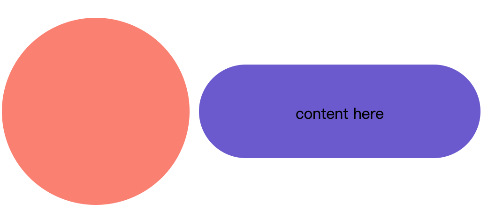

#### overflow溢出显示

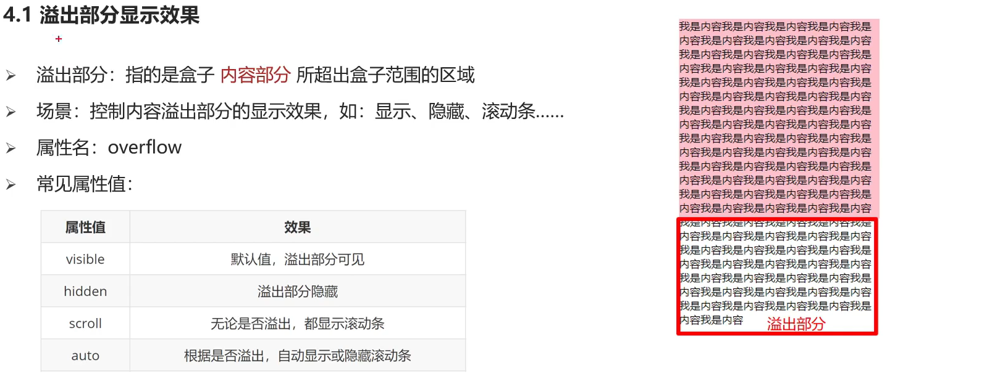


#### 元素隐藏

+ 效果：使元素盒子不显示（通常可以用在下拉菜单上）
+ 用法：
  + `visibility: hidden;` 占位隐藏，元素不显示，但是仍占据标准流位置
  + `display: none;` 不占位隐藏，元素不显示，且不占据标准流位置

#### 元素透明度

+ 效果：让整个元素（包含子元素和内容）变透明
+ 属性：opacity
+ 属性值：$[0, 1] \subset R$
  + 0 完全透明，1完全不透明


### 图像精灵

<a name="elf"></a>

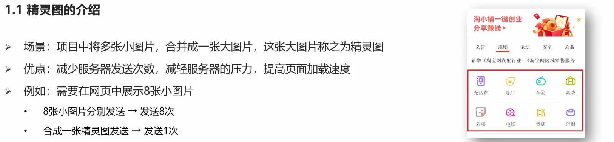

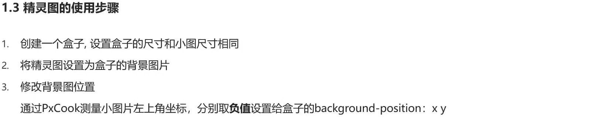

+ **注意，图片是一张大图（包含许多小图），精灵图的作用是，在这个大图中把各个小图取出来显示**
+ 用`background-postion` 来取出小图，x、y为图像左上角坐标，可以作为`background`的复合属性值，<a href="#bg">详见</a>

### 盒子阴影

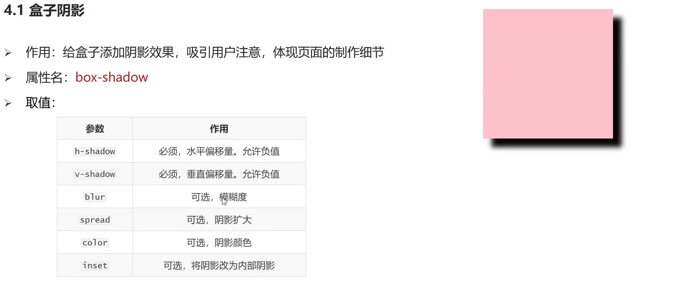


+ 注意以上取值是并列关系，`box-shadow: h-shadow v-shadow blur spread color inset;`
  + 注意`h-shadow、v-shadow、blur、spread` 取值为数字，inset取值就是inset，取inset则改为内阴影，不取则外阴影

### 过渡效果

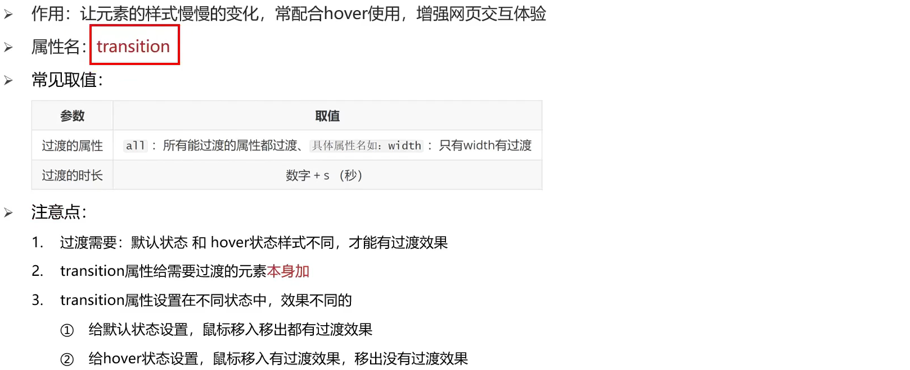

+ 示例效果（具体代码参考[这里](./source/html/transition.html)）：

  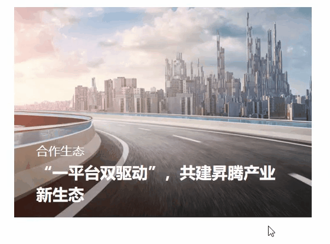

+ 注意:

  + transition一般配合hover使用，加在元素本身上，不加在hover上面
+ 如果需要过渡多种属性，使用逗号分隔，参考下面：
  
  + `transition: width 1s, color 1ms, background-color 1s;`
  + 但是一般直接写成`transition: all 1s;` 就好了

+ 过渡的效果，也可以用<a href="#ct">动画</a>实现，动画可以实现更加强大的过渡

### 字体图标

直接 link 调用别人设计好的样式，如 https://www.iconfont.cn/

### 渐变背景

<a name='bgi' href='#bg'> 回顾背景相关知识</a>

+ 一般用于设置盒子的背景，使其呈现渐变效果

+ 用法：`background-image: linear-gradient( color-1, color-2, color-3,...);`

  + 可以使得盒子背景从 color-1 渐变到color-2 再渐变到 color-3
  + `background-image: linear-gradient( transparent, rgba(0,0,0, 0.5));`
    + 以上可以实现，从透明变成黑色半透明

+ 注意如果设置了linear-gradient，那么背景图会被覆盖掉，变成纯色的渐变

  + 复合也没用，即不可以`background-image: url() linear-gradient();` 这样写语法错误，不会生效

  + 一般要实现图片上方的渐变效果，图片用img标签，然后再用渐变背景，一般写一个mask类的div加渐变背景，如

    + ```html
      <style>
          .box {
              positon: relative;
          }
          
          .box img {
              width: 700px;
              height: 350px;
          }
          
          .box .title {
              postion: absolute;
              left: 20px;
              bottom: 15px;
              /* 这里加z-index使得title的字在最上方，
              不加则mask会盖住，z-index必须配合position使用 */
              z-index: 2;
              width: 390px;
              color: white;
              font-size: 20px;
              font-weight: 700;
          }
          
          .box .mask {
              /* 默认情况下看不见，下面两种选其一 */
              /* display: none; */
              opacity: 0;
              /* 宽高要和img一样大 */
              width: 700px;
              height: 350px;
              background-image: linear-gradient(
                  transparent,
                  rgba(0,0,0, 0.5);
              );
              transition: all 0.5s;
          }
          
          .box:hover .mask {
              /* 鼠标悬浮显示，下面两种选其一 */
              /* display: block; */
              opacity: 1;
          }
      </style>
      
      <body>
          <div class="box">
              
              <div class="title">
                  Your content here...
              </div>
              <!-- 这里的mask其实也可以用伪元素实现，但代码量会增加 -->
              <div class="mask"></div>
          </div>
      </body>
      ```

### transform - 平面2D转换

#### 位移

+ 平移位置：`transform: translate(x, y)`
  + x,y 可以取 像素、百分比（参照物为盒子自身尺寸，注意不是父元素尺寸哦）
  + x正右，y正下
  + 如果要单方向移动，使用`transform: translateX(); 或 transform: translateY();`
  + 如果`translate() `只有一个值，那就等效于`translateX()`

#### translate实现居中

使用translate快速实现元素居中效果，<a href='#trans'>参见</a>

#### 旋转

+ 围绕中心旋转：`transform: rotate( x deg);`
  + deg 为角度单位，度，x可取正负实数（所有单位都要紧跟在数字后面）
  + 注意，rotate通常配合transition使用（transition加在父盒子上），这样就能显示旋转过程，不加过渡只会显示旋转结果
  + 若需要改旋转中心，则参考后面的“转换原点”

#### 转换原点

+ 默认的原点是元素盒子的中心（也即 center center），可以通过 `transform-origin: x y;` 转换原点位置
  + x，y取值：
    + 方位词：left、top、right、bottom、center
    + 像素值
    + 百分比（参照盒子自身尺寸计算）
  + x,y是相对于元素盒子自身的位置，左上角为0 0 或者 left top
  + 一般将transform-origin加在元素本身，不加在其hover上
  + 可以配合实现围绕不同中心的位移、旋转、缩放

#### 缩放

+ 按中心放大缩小：`transform: scale(x, y);`
  + x,y 是缩放的倍数
  + 若只设置一个值，则x、y等比例缩放

#### 复合实现多种效果

+ transform为复合属性，可以连写，如：

  + `transform: translate(100px) rotate(360deg); ` 可以实现向右滚动前进100px
    + 【注意要先写平移，换一下效果就不一样了，换一下就是螺旋向右前进】

+ 注意多行transform只生效最后一条，如：

  ```css
  .class-name:hover {
  	transform: tanslate(100%, 100%); /* 位移，不生效*/
  	transform: scale(2); /* 缩放，生效 */
  }
  ```


### transform - 空间3D转换

css的空间坐标系，x轴左右向（右正），y轴上下向（下正），z轴前后向（垂直屏幕向人为正，后正）

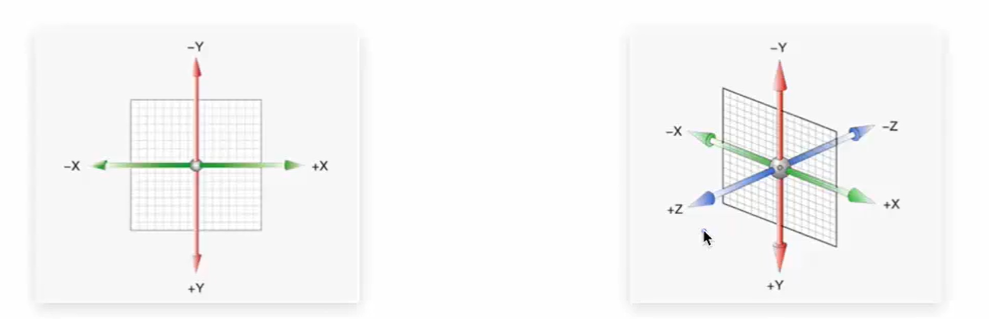

#### 3D 位移

+ 空间位移：`transform: translate3d(x,y,z);`

+ 单方向：

  + `transform: translateX();`
  + `transform: translateY();`
  + `transform: translateZ();`

+ 取值注意事项同 2D，同时记得最好配合 transition 显示过程

+ 注意，Z轴方向的位移，需要配合perspective属性（透视效果）才能看出效果

  + perspective实现透视效果，即画画的透视，简单理解就是近大远小、近清除远模糊

  + perspective属性加在父级元素上，取值为像素，值一般建议取 800 ～ 1200px

    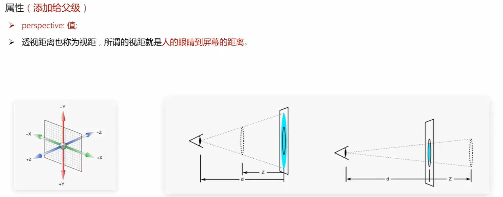

#### 3D 旋转

+ 单方向（沿着某轴旋转）：
  + 沿Z轴旋转（平面旋转）：`transform: rotateZ(k deg);` 注意这个等效于平面的旋转`transform: rotate(k deg);`
  + 沿X轴旋转（前后翻转）：`transform: rotateX(k deg);` 正数向前翻转
  + 沿Y轴旋转（左右翻转）：`transform: rotateY(k deg);` 正数向右翻转
    + 旋转方向用左手法则：左手握住旋转轴，拇指为正轴，其余手指弯曲方向为旋转正向（不记忆，靠直觉就好）
    + ==注意旋转之后，会改变坐标轴方向！！即坐标系是跟着一起转动的，不是不变的！！在做盒子案例中体现==
+ 取值注意事项同 2D，同时记得最好配合 transition（加在原自身盒子） 显示过程，并且最好配合perspective（加在父级盒子）
+ 自定义旋转轴旋转：`transform: rotate3d(x,y,z, k deg);`
  + $x,y,x \in [0,1] \subset R$ 用于定一个新的旋转轴位置
  + k deg 则是旋转角度
  + 一般不会用到这个，太复杂

#### 立体呈现

+ 效果呈现一个立体图形，如下例：

  

+ 实现方法：

  + 父元素添加`transform-style: preserve-3d;`
    + 使得子元素在3D空间内呈现
    + 默认值为flat，即`transform-style: flat;` 表示子元素在2D平面内呈现

+ 例子:

  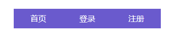
  
  ```html
  <style>
  	/* 导航条 */
      ul {
          margin: 0;
          padding: 0;
          list-style: none;
      }
  
      .nav {
          width: 300px;
          height: 40px;
          margin: 50px auto;
      }
  
      .nav li {
          position: relative;
          float: left;
          width: 100px;
          height: 40px;
          line-height: 40px;
          transition: all 0.5s;
          transform-style: preserve-3d;
  
          /* 中间代码后期要注释掉, 先倾斜一下,方便从侧面看立体盒子的搭建 */
          /* transform: rotateX(-20deg) rotateY(45deg); */
      }
  
  
      .nav li a {
          display: block;
  
          position: absolute;
          left: 0;
          top: 0;
  
          width: 100%;
          height: 100%;
          text-align: center;
          text-decoration: none;
          color: #fff;
      }
  
      .nav li a:nth-child(1) {
          background-color: slateblue;
          transform: translateZ(20px);
      }
  
      .nav li a:last-child {
          background-color: salmon;
          /* 注意旋转之后,向上平移,此时的向上不是Y轴了,是Z轴,时刻注意旋转是连同坐标系一起旋转的 */
          transform: rotateX(90deg) translateZ(20px);
      } 
  
      .nav li:hover {
          transform: rotateX(-90deg);
      }
  </style>
  
  <body>
      <div class="nav">
          <ul>
              <li>
                  <a href="#">首页</a>
                  <a href="#">Index</a>
              </li>
              <li>
                  <a href="#">登录</a>
                  <a href="#">Login</a>
              </li>
              <li>
                  <a href="#">注册</a>
                  <a href="#">Register</a>
              </li>
          </ul>
      </div>
  </body>
  ```
  
#### 3D 缩放

+ 单方向缩放:
  + `transform: scaleX(k);`
  + `transform: scaleY(k);`
  + `transform: scaleZ(k);`
+ 多方向 `transform: scale3d(x,y,z);`

### CSS 动画

<a name="ct"></a>

过渡一般用于实现 鼠标悬浮（或其他某个行为）使其显示出现差异（2个状态之间的切换），而动画不仅可以实现过渡的效果，还能实现循环往复的播放和其他更复杂的效果（多个状态，并且可选择进行播放控制）

使用`animation`属性添加动画效果

+ 定义动画

  + 2个状态的动画：

    ```css
    @keyframes your-animation-name {
        /* 若动画的开始状态和盒子默认样式相同，则可省略开始状态 from */
    	from { css attrs; }
    	to { css attrs; }
    }
    ```

  + 多个状态的动画：

    ```css
    @keyframes your-animation-name {
    	0% { css attrs; }
    	10% { css attrs; }
    	15% { css attrs; }
    	100% { css attrs; }
    }
    ```

    + 百分比是动画总时长的占比，即播放到 x% 发生什么变化

+ 使用动画：

  ```css
  animation: name duration timing-function delay iteration-count direction fill-mode;
  ```

  + 解释`animation: 动画名称 时长 速度曲线 延迟时间 重复次数 动画方向 执行完成时状态;`

  + name、duration必须赋值，取值不分先后顺序但是如果有2个时间，第一个表示duration，第二个表示delay

    + 无限循环播放，设置delay取值为 infinite（取其他数字，如3则播放3次）
    + timing-function 还可以取值 step(k)，表示分成k段播放（就是将总时长切分成k段播放）
    + direction通常会设置alternate，可以在无限播放的时候有一个反向动画，轮流反向播放
    + fill-mode是动画完毕状态，无限循环（即delay取值infinite）播放时不生效（或者说看不出来），fill-mode取backwards表示播放完毕回到最初状态，取forwards则保持最后一个属性值（在最后一个关键帧中定义，即播放完毕停留在最后状态）
    + 关于各个属性的更详细解释，参考 [css animation属性介绍](https://www.w3school.com.cn/cssref/pr_animation.asp)/[animation动画教程](https://www.w3school.com.cn/css/css3_animations.asp)

  + animation属性直接加在需要动画的元素身上

  + 加载页面时，动画就会自动播放（除非设置在hover等动作上）

  + 以上为复合属性写法的animation，也可以单独分开写（注意name和duration仍然是必写的）

    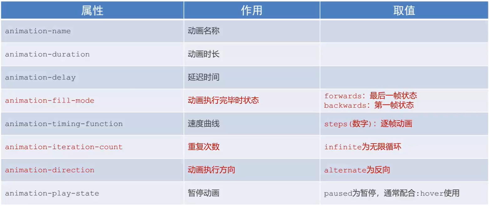

+ 参考 [例子](./source/html/animation.html)

+ 补间动画与逐帧动画：

  + 补间动画没有顿挫感，播放流畅（过渡transition的效果是补间动画，不加steps的animation其实也是补间的）
  + 逐帧动画就是一帧帧播放，有明显顿挫感

+ 是用steps实现逐帧动画：

  + 用在 animation-timing-function 属性上：`animation-timing-function: steps(n);`
  + 将动画过程等分成n份
  + 一般配合<a href='#elf'>精灵图</a>实现动画效果，参考 [例子](./source/html/animation.html)
  + 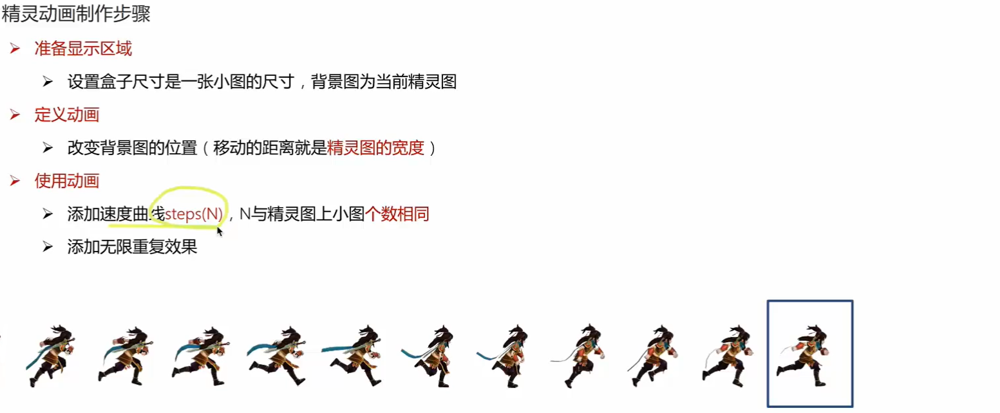

+ 多组动画使用逗号分隔（注意不是写多个animation，多个只生效一个）

  ```css
  animation: animation-attrs-1, animation-attrs-2, ...;
  ```


### 百分比布局（流式布局）

效果：宽度自适应，高度固定（即 width=k%，height=m px 的写法）

> - 流式布局，就是百分比布局，也称非固定像素布局。
> - 通过将盒子的宽度设置成百分比，从而根据屏幕的宽度来进行伸缩，不受固定像素的限制，内容向两侧填充。
> - 注意事项：需要定义页面的最大和最小支持宽度。

百分比布局是比较早期的布局方案了

### Flex 布局（弹性布局）模型

利用flex布局模型能更加灵活、快速的进行布局，可以解决浮动布局导致的脱标问题

+ flex布局启用：`display: flex;`
+ 加在父盒子之上，父盒子内部的元素就会自动进行弹性布局，即子元素不脱标，占空间，父盒子可以不设置宽高，由子元素撑开
+ 子元素之间的空隙，可以不用margin设置，可在父级通过 justify-content 进行调节

#### Flex布局模型的构成

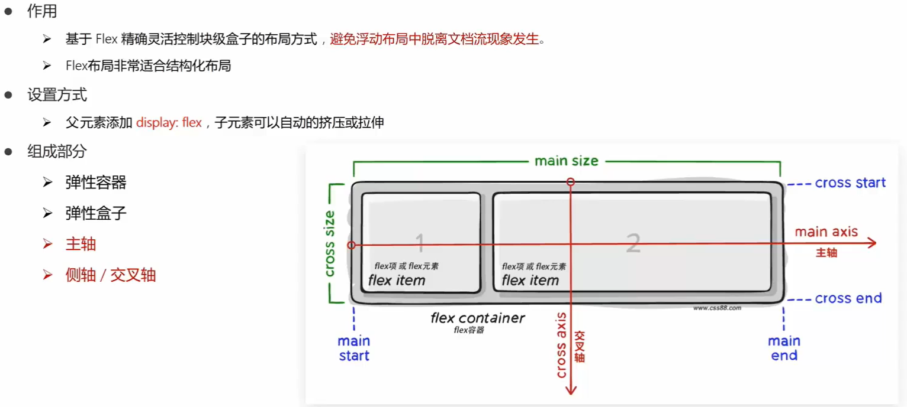

+ 添加了`display:flex;`的父元素，被称作弹性容器；容器内的子元素，称作flex项（弹性盒子）
+ 弹性盒子（flex项）默认按照主轴排列（主轴默认水平向右）

#### 主轴对齐方式

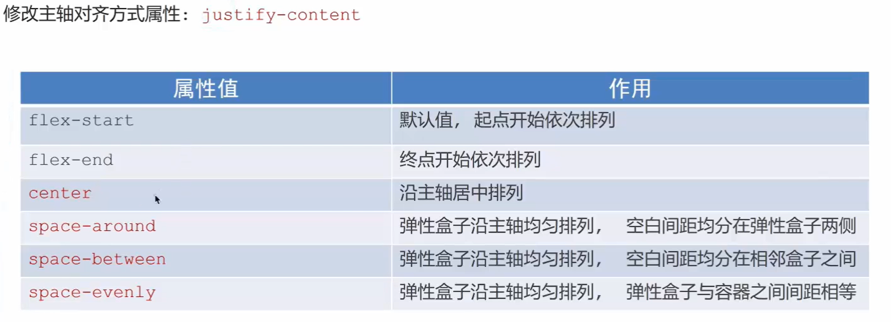

+ 注意，justify-content 添加在父级元素，即 flex container上
+ 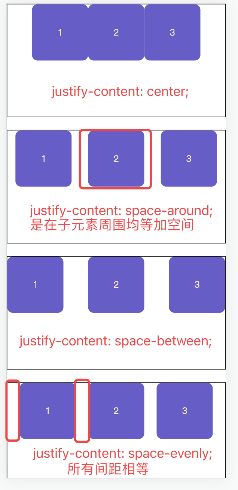
  + 注意，由于space-around是在子元素两侧加均等空间所以子元素间距离是子元素到父元素边缘距离的2倍

#### 侧轴对齐方式

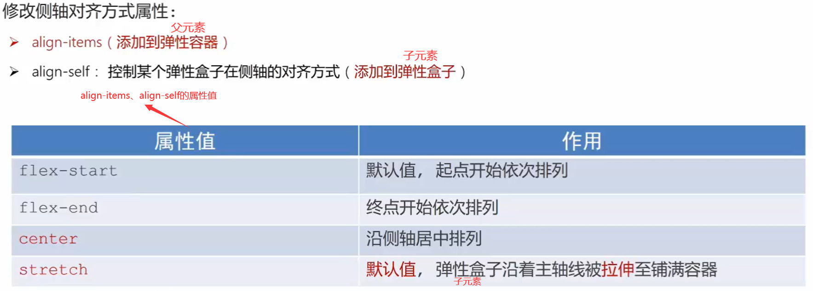

+ 注意，默认值为stretch会将子元素按照主轴拉伸（但是若子元素设置了height则不会拉伸）

#### Flex布局子元素尺寸问题

+ 若子元素设置宽高，则按照宽高显示
+ 若子元素只设置一个height，则width由子元素内容撑开
+ 若子元素只设置width且没有设置主轴对齐为center（即默认stretch），那么height自动拉伸撑满父容器
+ 若设置了主轴对齐center，那么宽高若设置则按设置来，没设置就由子元素内容撑开

#### 子元素（弹性盒子）伸缩比

+ 用法：`flex: k;` 

+ k为数

+ 加在子元素身上，将子元素尺寸缩放到 剩余父容器未占用尺寸的 k 份

+ 注意，以下代码，会将 第2个son元素尺寸缩放到 父容器box 剩余未占用尺寸的 $\frac{1}{1+2}$（计算剩余尺寸时，使用flex属性的子元素是不算进去的）：

  ```css
  .box son:nth-child(2) {
  	flex: 1;
  }
  .box son:nth-child(5) {
  	flex: 2;
  }
  ```

  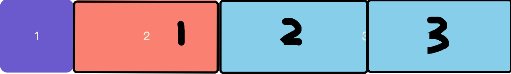

+ 这种写法，可以让元素自动适应不同窗口大小，进行缩放

#### 改变主轴方向

+ `flex-direction`属性可以改变主轴方向，即改变子元素的排列方向

  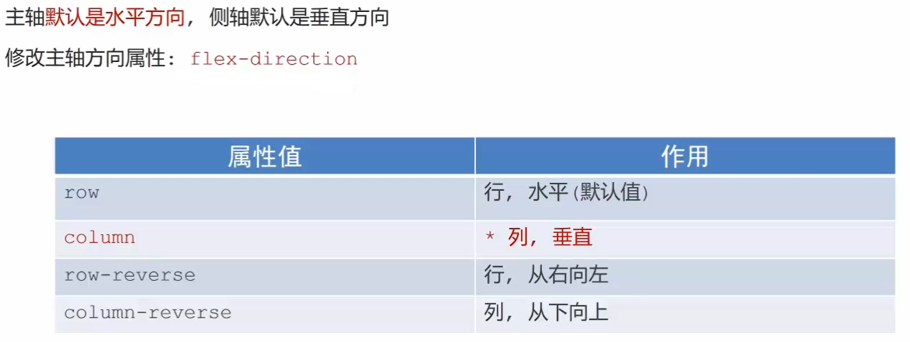

+ `flex-direction: column;` 可以使得子元素垂直排列

  + 注意，==改主轴方向之后，`justity-content`等其他和主轴相关的属性，是会随着变成垂直了==，例如主轴改成column之后，`justity-content: center;`就不再是水平居中排列了，而是垂直居中了，**==并且此时侧轴就会变成水平方向==**，可以理解为整个坐标系翻转，此时`align-item: center;`使得侧轴元素居中排列，就是水平居中了
  + ==**时刻注意主轴变动前牵制其他属性，flex模型 主轴、侧轴 是布局的核心，布局排列子元素前先确定轴系方向！**==

#### 子元素（弹性盒子）多行排列

之前多行排列，用float实现，一行拍不下就会自动换行排，但是浮动的元素脱标不占位，这是个不太舒服的地方，如果父盒子不给出宽高的话，就无法撑开，需要额外代码进行解决。因此，通过flex布局模型，实现子元素多行排列是较佳的方案。

+ flex模型又名，弹性布局模型，因此，当设置弹性容器即盒子之后，默认情况下，子元素（弹性盒子）会自动按照主轴水平一行排列，并且只在一行排列，如果一行撑不下所有子元素，则会使得子元素压缩尺寸，使其强行一行排列（弹性盒子，弹性！）。解决此问题，使用 `flex-wrap:wrap;` 属性进行换行排列，参见 [例子](./source/html/flex.html)

+ flex-wrap 取值

  + 默认取值 nowrap，不换行排列，**按照主轴一行排列，排列不进则强行压缩排进**
  + 换行排列取值 wrap
  + 逆序换行排列 wrap-reverse，从下往上依次排列
  + 注意 flex-wrap 添加在容器上（即父元素）

+ ==**注意换行排列之后，会在行之间自动添加空隙，空隙距离均分父盒子剩余空间**==

  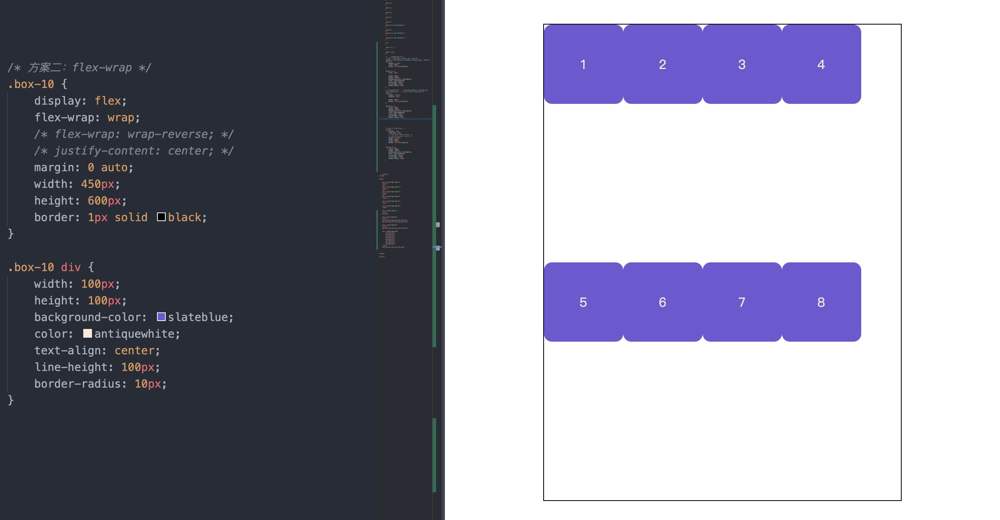

##### 多行排列的行（主轴）对齐方式

在flex布局时，设置wrap之后，通过 `align-content` 调整 行对齐（主轴对齐）方式，==**注意是调整行之间的对齐，可以理解为行间距**==

align-content 取值：

+ flex-start：默认，按起点开始换行排列，默认会在行之间自动添加空隙，空隙距离均分父盒子剩余空间
+ flex-end：逆序排列，空隙同上
+ center：居中
+ space-between：行间均分，最上行最下行顶父盒子
+ space-around：在每一行上下加均分父盒子剩余空间的空隙
+ stretch：拉伸子元素height尺寸至填满整个父盒子，对设置了height的子元素无效（注意不设置width也不会拉伸width）

⚠️ 注意注意注意点：

+ 与`justify-content` 相比，align-content没有 space-evenly 的属性值

+ `align-content` 把每一个行视作一个整体，调节行之间的对齐，可以理解为调节行间距

+ `justify-content` 是调整每一个行内的子元素的对齐方式

+ 举个例子对比一下：

  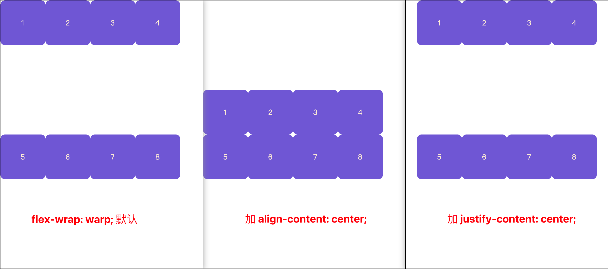

### Grid 布局（网格布局）


参考：

+ [CSS 网格布局模块 (w3school.com.cn)](https://www.w3school.com.cn/css/css_grid.asp)
+ [CSS Grid 网格布局教程 - 阮一峰的网络日志 (ruanyifeng.com)](https://www.ruanyifeng.com/blog/2019/03/grid-layout-tutorial.html)


### CSS 属性书写顺序

这里所说的css属性顺序是指在书写代码的时候，属性书写的先后顺序，虽然先后不影响显示效果，但是良好的书写顺序会提高代码的可读性和浏览器执行效率

> 建议遵循以下顺序
>
> 　1.布局定位属性：display / position / float / clear / visibility / overflow（建议 display 第一个写，毕竟关系到模式）
>
> 　2.盒子模型自身属性：width / height / margin / padding / border /background 
>
> 　3.文本属性：color / font / text-decoration / text-align / vertical-align / white-space / break-word
>
> 　4.其他属性（CSS3 属性）：content / cursor / border-radius / box-shadow / text-shadow / background
>
> 参考：[CSS 属性书写顺序](https://www.cnblogs.com/qtbb/articles/11730749.html)


### 媒体查询

#### 媒体查询基本概念 <a name="media"></a>

+ 功能：使用媒体查询能设置差异化CSS样式

+ 原理：媒体查询能够检测视口（viewport）的宽（width），然后实现差异化CSS样式（当某个条件成立时，执行对应的css样式）

+ 写法：

  ```css
  @media (媒体特性) {
  	css选择器 { css attrs; }
  }
  
  /* 更加通用的写法：*/
  @media not|only mediatype and (expressions) {
    CSS-Code;
  }
  /* 中文解释 */
  @mdedia 逻辑关键词 媒体类型 and (媒体特性表达式) {
      CSS 代码
  }
  ```

  + 逻辑关键词：not、only(一个控制条件时一般不加，因为加不加等效)、and

  + mediatype：

    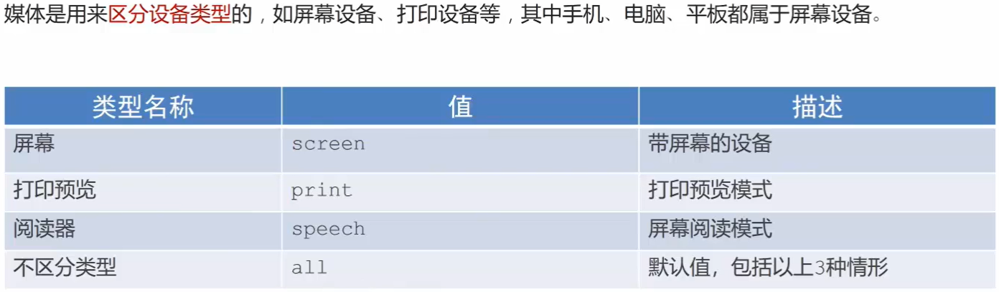

    + screen基本上加不加也没啥区别，因为。。。显示必须要加屏幕

  + 媒体特性（expression）：

    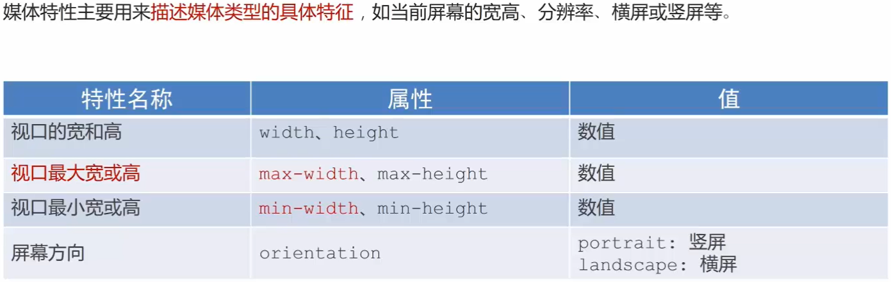

  + 通用写法参考：https://www.w3school.com.cn/css/css3_mediaqueries.asp

#### 媒体查询外链引入

直接使用`<link>` 标签引入

+ ```html
  <link rel="stylesheet" media="not|only mediatype and (expressions)" href="your.css">
  <!-- 只带expression时，括号必须加 -->
  <link rel="stylesheet" media="(expresions)" href="your.css">
  ```

  + 注意此时不用写 `@media` 
  + `<link>` 标签内的media作用于后面的 `your.css` 之上，即该媒体查询的 css效果是通过 `your.css` 设置的

+ 

## 移动端适配

+ PC端网页和移动端网页：

  + 通常，PC端网页和移动端网页不是同一个，需要分开开发
  + PC网页通常固定版心（版心居中）
  + 移动端通常网页宽度为100%
  + 移动端调试网页效果，可以用PC浏览器的模拟器

+ 移动设备屏幕尺寸：

  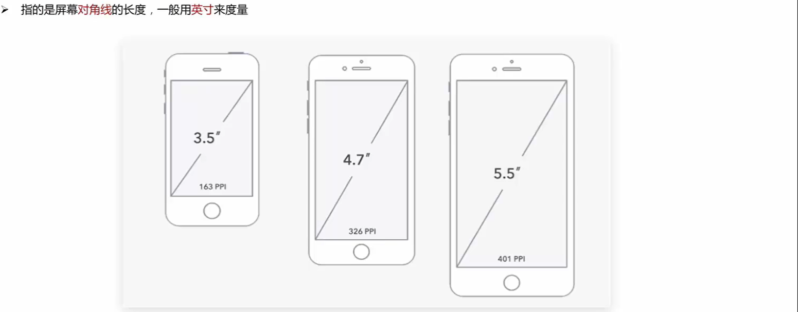

+ 分辨率问题：

  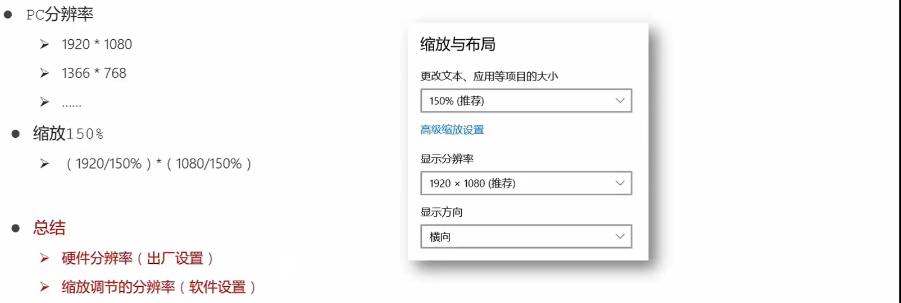

  + 宽像素个数 x 高像素个数
  + 物理分辨率：生成屏幕时固有，硬件决定，不可改变
  + 逻辑分辨率：软件（驱动）决定，可以调整
  + 网页布局时，按照逻辑分辨率设计

### 视口 viewport

+ 通过在`<head>`标签中添加 `<meta name="viewport" content="width=device-width, initial-scale=1.0">`可以适配目标移动设备的逻辑分辨率
  + `width=device-width` 适配显示宽度（即整体的`<html>`宽度）为设备宽度
    + 若需要改宽度直接加数字，不用带像素单位，如`width=700` 会将宽度固定为 700px
  + `initial-scale=1.0` 初始缩放规模为 1.0 ，即默认一致
+ viewport一般用于移动端适配，PC端默认和屏幕分辨率尺寸一致
+ 更多视口知识：[响应式网页设计 - 视口](https://www.w3school.com.cn/css/css_rwd_viewport.asp)

### 二倍图

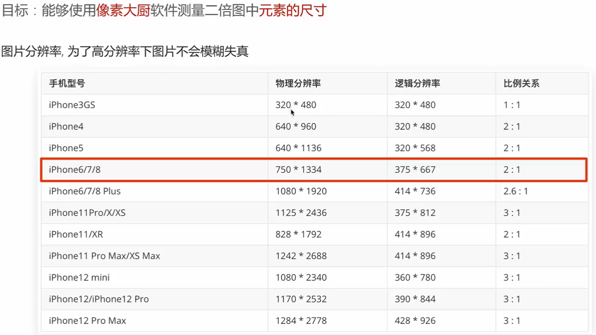

通常UI设计师在设计界面时，给的设计稿是2倍于实际设备显示尺寸（参考iPhone6/7/8），在实际开发时，不能以设计稿尺寸进行元素尺寸编写，要注意一个换算关系，PxCook的开发模式可以换算

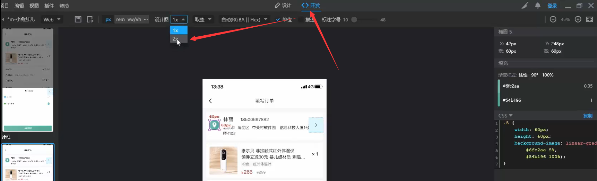

多倍图的作用是为了让图片分辨率更高，即实际开发时的1px 对应设计图的 2px（这里不太确定，到时候在多查查资料）

### 移动适配解决方案

使用 px 单位的元素尺寸固定，在任何设备上都是一样大小显示，就会出现显示不适配的问题。

而使用百分比布局（即%作元素尺寸单位）可以实现width等比例缩放，但是height往往会进行固定，仍然存在一定不适配的问题。

解决方法：

+ rem：当前多数企业使用的解决方案
+ vw / vh：面向未来的解决方案

实际上简单理解成和 px 一样的单位

参考资料：

+ [px、em、rem区别介绍](https://www.runoob.com/w3cnote/px-em-rem-different.html)

#### rem 单位

通过使用rem作为元素的尺寸单位，来实现移动端适配效果（即更换不同移动设备，实现等比例布局），根据不同移动设备的网页尺寸自动等比例缩放元素尺寸

> rem（font size of the root element）是指相对于根元素的字体大小的单位。简单的说它就是一个相对单位。看到rem大家一定会想起em单位，em（font size of the element）是指相对于父元素的字体大小的单位。它们之间其实很相似，只不过一个计算的规则是依赖根元素一个是依赖父元素计算。
>
> [rem是如何实现自适应布局的？](http://caibaojian.com/web-app-rem.html)

+ rem单位：

  + 相对单位

  + rem单位是相对于HTML标签（网页根标签`<html></html>`）的字号计算结果

    + 例如，如果设置了html的font-size，则按照其为计量单位

      ```css
      html {
      	font-size: 30px;
      }
      
      .box {
          width: 5rem;
          height: 7rem; /* 该盒子的大小为 150px，210px */
          background-color: slateblue;
      }
      ```

  + 1rem = 1 HTML字号大小

+ 利用移动适配

  + 由rem的原理可推知，要实现移动适配，则需要让html标签的字号在不同设备下不同（即html字号自适应了，那么就能通过rem单位使得整个网页所有元素自适应）
  + 如何根据不同设备的分辨率来自适应html字号，且不同分辨率下html字号设置多少合适？
    + 使用 “媒体查询” 技术

+  <a href="#media">媒体查询</a>

  + 举例：

    ```html
    <style>
        /* 当 viewport 的width=375px时，设置html标签字号为37.5px
        iPhone6/7/8设备视口是375px，那么当该设备打开网页时，html字号自适应到37.5px
        */
        @media (width:375px) {
            html {
                font-size: 37.5px
            }
        }
    </style>
    ```
  
    以上例子在PC端模拟测试时，需要注意你的PC端屏幕需要设置为100%，不然缩放情况下有误差，如下图：
  
    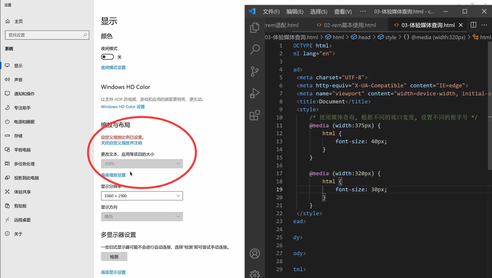
  
+ 利用媒体查询实现移动适配

  + 设备宽度不同，HTML字号设置多少合适？
    + 一个原则：设备宽度大，则元素尺寸大，反之亦然。
    + rem布局方案中，通常将网页宽度等分为 10 份，HTML标签字号设置为 视口宽度的 $\frac {1}{10}$ 
  + 以上方法，自己实现移动适配基本上还是存在较大难度：
    + 一方面是要写不同设备的媒体查询去自适应html字号，要写一堆媒体查询（这个之后可以通过js简化代码）
    + 另一方面测试时还会有系统缩放的显示问题
    + 最重要的问题是：实际开发，UI给的设计稿中是像素px单位，如果用rem，换算得换死你
      + 如，设计稿一个元素的width=68px，设计稿适配375px视口，那么换算成rem的尺寸为 $\frac {68} {375/10} \approx 1.813rem$
      + 换算公式：$k \text{(px)} = \frac {k}{\text{viewportWidth}/ 10} \text{(rem)}$
  + 为解决以上问题，实际开发，通过调用 `flexible.js` 配合rem实现移动端适配，使用less实现单位换算
  
+ flexible.js

  + 简介：由手淘开发出来的一个用于适配移动端的js框架
  
    + 官方repo：https://github.com/amfe/lib-flexible
  
  + 核心原理：自动根据不同viewport宽度设置html字号（就是我上面写了一大堆的原理）
  
  + 框架代码分析：[flexible.js 布局详解](http://caibaojian.com/flexible-js.html)
  
  + 使用方法，就是直接调用该js文件即可（js的使用参见之后的js笔记）
  
    + 参考：[flexible.js 移动端自适应方案](https://www.jianshu.com/p/04efb4a1d2f8)
  
    + 在线调用地址（如果挂了，自己再找别的）：
  
      ```html
      <script src="http://g.tbcdn.cn/mtb/lib-flexible/0.3.2/??flexible_css.js,flexible.js"></script>
      ```
  
  + 注意：调用felxible.js 只能解决适配问题，开发时px和rem还是得算，解决方法👉 Less语法
  

#### Less （CSS扩展语法）

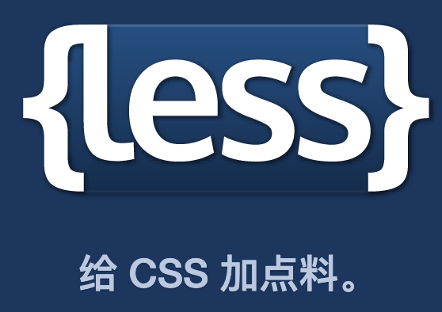

CSS 语法不支持计算等操作（如简单的加减乘除 <del>width: (100+1)/(375/10)rem</del>)，那如果要写px和rem等单位的换算，就得手动算好，太麻烦了！！咋办？用Less进行扩展！！

**Less：**

+ Less （Leaner Style Sheets 的缩写） 是一门向后兼容的 CSS 扩展语言，使CSS具备一定的逻辑性、计算能力。

+ 可以把Less理解成一个CSS的预处理器，通过Less语法书写的代码在编译后生成CSS代码，Less文件后缀`.lss`

+ Less官网：https://less.bootcss.com/

+ vscode插件推荐：EasyLess，可以在写less代码的时候自动在当前路径生成同名CSS代码文件，直接改less文件，会自动改同名css代码。若要改生成路径，参考以下插件配置方法，我个人建议使用less语法写导出更佳。

  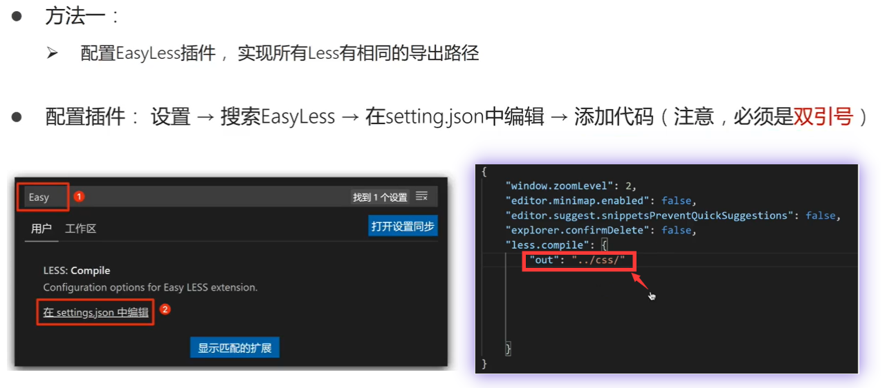

本节只介绍Less的最最皮毛的用法，更为详细的功能，参考 [官方教程](https://less.bootcss.com/#%E6%A6%82%E8%A7%88)

##### Less 语法

+ 注释：

  + 单行注释：`//`
  + 块注释：`/* content here */`

+ 变量：

  > `@`开头标记变量：
  >
  > ```less
  > // less code
  > @width: 10px;
  > @height: @width + 10px;
  > 
  > #header {
  >   width: @width;
  >   height: @height;
  > }
  > ```
  >
  > 编译为：
  >
  > ```css
  > /* css code */
  > #header {
  >   width: 10px;
  >   height: 20px;
  > }
  > ```
  >
  > [了解关于变量的更多信息](https://less.bootcss.com/features/#variables-feature)
  >
  > 比如一个工程中的某种颜色大量使用，可以定义变量使用，变量的使用提高了代码的可维护性，下次只需要改变量就可以批量改某些属性值

+ 运算：

  + 加减乘：`+ - *`

  + 除法：

    + 写法一（必须用括号包围，低版本less可能不加括号也行）：`width: (100 / 4px);` 【推荐】
    + 写法二 `./` ：`width: 100 ./ 4px` 【vscode可能会把 `./` 识别出语法错误，其实没错，不影响结果】

  + 运算符前后可加可不加空格，但是建议加上，清晰点

  + 单位直接跟在数字后面，单位自动强制转换：

    + ```less
      width: 5cm + 10mm; // 结果是 6cm
      width: 2 - 3cm - 5mm; // 结果是 -1.5cm
      
      // conversion is impossible
      @width: 2 + 5px - 3cm; // 结果是 4px
      ```

      > 算术运算符在加、减或比较之前会进行单位换算。计算的结果以最左侧操作数的单位类型为准。如果单位换算无效或失去意义，则忽略单位。无效的单位换算例如：px 到 cm 或 rad 到 % 的转换。
      >
      > 更多参见[官方文档](https://less.bootcss.com/#%E8%BF%90%E7%AE%97%EF%BC%88operations%EF%BC%89)

+ 混合

  > 混合（Mixin）是一种将一组属性从一个规则集包含（或混入）到另一个规则集的方法。假设我们定义了一个类（class）如下：
  >
  > ```css
  > /* css code */
  > .bordered {
  >   border-top: dotted 1px black;
  >   border-bottom: solid 2px black;
  > }
  > ```
  >
  > 如果我们希望在其它规则集中使用这些属性呢？没问题，我们只需像下面这样输入所需属性的类（class）名称即可，如下所示：
  >
  > ```less
  > // less code
  > #menu a {
  >   color: #111;
  >   .bordered();
  > }
  > 
  > .post a {
  >   color: red;
  >   .bordered();
  > }
  > ```
  >
  > 生成的css代码：
  >
  > ```css
  > /* css code */
  > #menu a {
  >   color: #111;
  >   border-top: dotted 1px black;
  >   border-bottom: solid 2px black;
  > }
  > .post a {
  >   color: red;
  >   border-top: dotted 1px black;
  >   border-bottom: solid 2px black;
  > }
  > ```
  >
  > `.bordered` 类所包含的属性就将同时出现在 `#menu a` 和 `.post a` 中了。（注意，你也可以使用 `#ids` 作为 mixin 使用。）

+ 嵌套（模仿html语法写后代选择器）：

  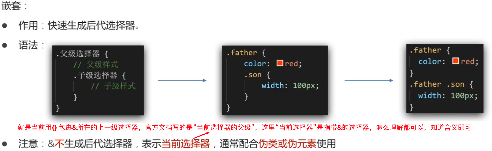

  > Less 提供了使用嵌套（nesting）代替层叠或与层叠结合使用的能力。假设我们有以下 CSS 代码：
  >
  > ```css
  > /* css code */
  > #header {
  >   color: black;
  > }
  > #header .navigation {
  >   font-size: 12px;
  > }
  > #header .logo {
  >   width: 300px;
  > }
  > ```
  >
  > 以上 CSS 代码可以用以下 Less 代码生成：
  >
  > ```less
  > // less code
  > #header {
  >   color: black;
  >   .navigation {
  >     font-size: 12px;
  >   }
  >   .logo {
  >     width: 300px;
  >   }
  > }
  > ```
  >
  > 用 Less 书写的代码更加简洁，并且模仿了 HTML 的组织结构。
  >
  > 你还可以使用此方法将伪选择器（pseudo-selectors）与混合（mixins）一同使用。下面是一个经典的 clearfix 技巧，重写为一个混合（mixin） (`&` 表示当前选择器的父级）：
  >
  > ```less
  > // less code
  > .clearfix {
  >   display: block;
  >   zoom: 1;
  > 
  >   &:after {
  >     content: " ";
  >     display: block;
  >     font-size: 0;
  >     height: 0;
  >     clear: both;
  >     visibility: hidden;
  >   }
  > }
  > ```
  >
  > 生成的 CSS 代码：
  >
  > ```css
  > /* css code */
  > .clearfix {
  >   display: block;
  >   zoom: 1;
  > }
  > .clearfix:after {
  >   content: " ";
  >   display: block;
  >   font-size: 0;
  >   height: 0;
  >   clear: both;
  >   visibility: hidden;
  > }
  > ```
  >
  > 更复杂的嵌套规则，参见：[ @规则嵌套和冒泡](https://less.bootcss.com/#%E5%B5%8C%E5%A5%97%EF%BC%88nesting%EF%BC%89)
  
+ 导入其他less/css文件：

  > “导入”的工作方式和你预期的一样。你可以导入一个 `.less` 文件，此文件中的所有变量就可以全部使用了。如果导入的文件是 `.less` 扩展名，则可以将扩展名省略掉：
  >
  > ```less
  > // 规则： @import "your_file.less";
  > // 注意文件用引号包裹，单双引号都可以
  > // import前要加@，import后要留空格
  > // 末尾必须加 ; 
  > @import "library"; // 也可以带后缀：library.less
  > @import "typo.css";
  > ```
  >
  > [了解更多关于导入(Importing)的知识](https://less.bootcss.com/features/#imports-feature)
  
+ 导出编译的CSS文件：

  > 在less文件开头添加“特别注释”
  >
  > // out: /your/own/path/
  >
  > 注意：
  >
  > + 末尾必须加上 `/` 不然生成的是文件名
  >
  > 如下
  >
  > ```less
  > // out: ./css/output
  > // out: ./css/output.css
  > // 以上两行等效
  > .box {
  > 	...
  > }
  > ```
  >
  > 以上代码会在当前路径的css文件夹下，将此less文件生成为 `output.css` 文件
  >
  > 生成与less文件同名文件的css，则写到文件夹位置，如下
  >
  > ```less
  > // out: ./css/
  > .box {
  > 	...
  > }
  > ```
  >
  > 以上代码会在当前路径的css文件夹下生成与less文件同名的css文件

+ 禁止导出CSS文件：

  + 使用 `// out: false ` 即可
  + 比如一些公共的less库，就不需要导出css，直接被其他less文件调用本身即可


##### Less 使用

最笨的方法就是先写Less然后生成CSS文件，然后将CSS文件通过 `<link>` 进行调用

更方便的使用方法是：

> Less 可以通过 npm 在命令行上运行；在浏览器上作为脚本文件下载；或者集成在广大的第三方工具内。
>
> 参考：https://www.runoob.com/manual/lessguide/#using-less

客户端使用：

> > **在浏览器上跑 less.js 非常方便开发，但是不推荐用于生产环境。**
>
> 在客户端使用 Less.js 是最容易的方式，并且在开发阶段很方便，但是，在生产环境中，性能和可靠性非常重要， *我们建议最好使用 node.js 或其它第三方工具进行预编译*。
>
> 那就开始吧，在页面中加入 `.less` 样式表的链接，并将 `rel` 属性设置为 "`stylesheet/less`"：
>
> ```html
> <link rel="stylesheet/less" type="text/css" href="styles.less" />
> ```
>
> 接下来，下载 [less.js](https://github.com/less/less.js/archive/master.zip) 并通过 `<script></script>` 标签将其引入，放置于页面的`<head>` 元素内：
>
> ```html
> <script src="less.js" type="text/javascript"></script>
> ```
>
> 或者使用在线CDN
>
> ```html
> <script src="//cdnjs.cloudflare.com/ajax/libs/less.js/1.7.3/less.min.js"></script>
> ```
>
> **提示**
>
> - 务必确保在 less.js 之前加载你的样式表。
> - 如果加载多个 `.less` 样式表文件，每个文件都会被单独编译。因此，一个文件中所定义的任何变量、mixin 或命名空间都无法在其它文件中访问 。


#### vw / vh 单位

相对单位 vw / wh

+ 相对视口的尺寸计算结果作为计量单位

+ vw：viewport width
  + 1 vw = $\frac{1}{100}$ 视口宽度
  + 换算px：
    + 设计稿一个元素的width=68px，设计稿适配375px视口，那么换算成 vw的尺寸为 $\frac {68} {375/100} \approx 18.133vw$
    + 换算公式：$k \text{(px)} = \frac {k}{\text{viewportWidth}/ 100} \text{(vw)}$
+ vh：viewport height
  + 1 vh = $\frac{1}{100}$ 视口高度
  + 换算px：
    + 设计稿一个元素的height=70px，设计稿适配667px视口，那么换算成rem的尺寸为 $\frac {70} {667/100} \approx 10.495vh$
    + 换算公式：$k \text{(px)} = \frac {k}{\text{viewportHeight}/ 100} \text{(vh)}$
+ 设计稿px换算，还是利用 less 语言
+ ⚠️ 注意：设计稿px单位，无论用vw还是vh单位，实际显示是一样大的（废话，换算出来的px值是一样的）
  + `1px = 1/3.75vw = 1/6.67vh `（分辨率为375x667情况下）

注意，单位可以混用（但是不建议），如

```css
.box {
	/* 使用vw作单位 */
	width: 70vw;
	height: 90vw;
	
	/* 使用vh作单位 */
	width: 70vh;
	height: 90vh;
	
	/* 混用 */
	width: 70vw;
	height: 90vh;
}
```

vw / vh 相对于 rem 简化了 rem 的根字号设置，rem需要先根据viewport width设置一个根字号

利用less可以更方便开发：

```less
@vp-width: 375;
@vp-height: 667;
@vw: (@vp-width / 100vw);
@vh: (@vp-height / 100vh);

.box {
	// width: 70px;
	width: (70 / @vw);
	// height: 90px;
	height: (90 / @vh);
}
```


## 响应式网页（RWD）

Responsive Web design

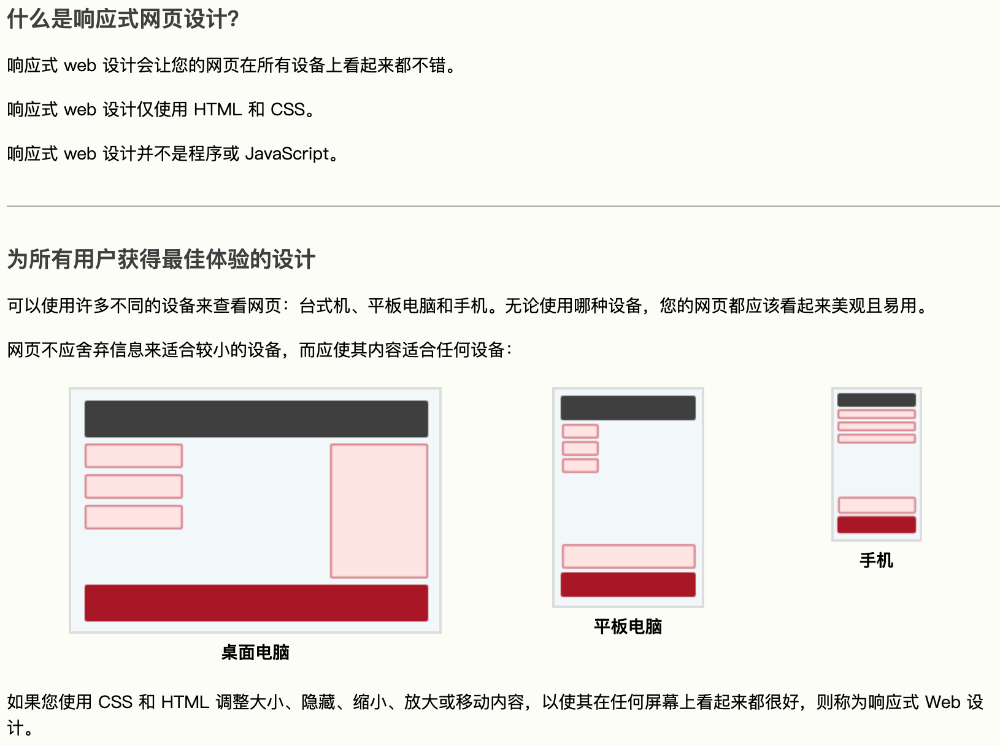

不仅是不同屏幕尺寸下的显示，同样在PC上，缩放浏览器尺寸，网页仍然可以显示全部内容，自动适应缩放（注意这个和移动端适配的区别）。

> 截图取自：[ 响应式网页设计 - 简介](https://www.w3school.com.cn/css/css_rwd_intro.asp)
>
> 百度百科：[响应式网页设计](https://baike.baidu.com/item/%E5%93%8D%E5%BA%94%E5%BC%8F%E7%BD%91%E9%A1%B5%E8%AE%BE%E8%AE%A1)

通常可以使用flex弹性布局、媒体查询等方式配合实现RWD

### 利用媒体查询实现RWD

<a href="#media">媒体查询知识回顾</a>

+ 利用`max-width`、`min-width` 控制视口区间条件：

  + 例子：

    ```css
    /* 视口宽度 <= 768px, 网页背景显示salmon色 */
    @media (max-width: 768px) {
        body {
        	background-color: salmon;
    	}
    }
    /* 视口宽度 >= 1200px, 网页背景显示slateblue色 */
    @media screen and (min-width: 1200px) {
    	body {
    		background-color: slateblue;
    	}
    }
    ```

  + 注意 CSS 层叠性：

    ```css
    /* 视口宽度 >= 768px, 网页背景显示salmon色 */
    @media (min-width: 768px) {
        body {
        	background-color: salmon;
        }
    }
    
    /* 视口宽度 >= 1200px, 网页背景显示slateblue色
      【不会生效，因为被后面的 >=900px 层叠掉了，
       所以>=1200px 不会显示slateblue而是显示900px条件的 skyblue】 
     */
    @media (min-width: 1200px) {
        body {
        	background-color: slateblue;
        }
    }
    
    /* 视口宽度 >= 900px，网页背景显示skyblue */
    @media (min-width: 900px) {
        body {
        	background-color: skyblue;
        }
    }
    
    ```

    + 由此，若通过`min/max-width` 写多个区间控制，则需要遵循以下规则：
      + `min-width` 从小到大顺序写
      + `max-width` 从大到小顺序写

+ 利用flex布局配合媒体查询实现小窗口时部分内容隐藏（收起）：

  

  + 参见 [例子](.source/html/RWD-2.html)

  
  

### 利用BootStrap框架实现RWD

参见BootStrap部分
